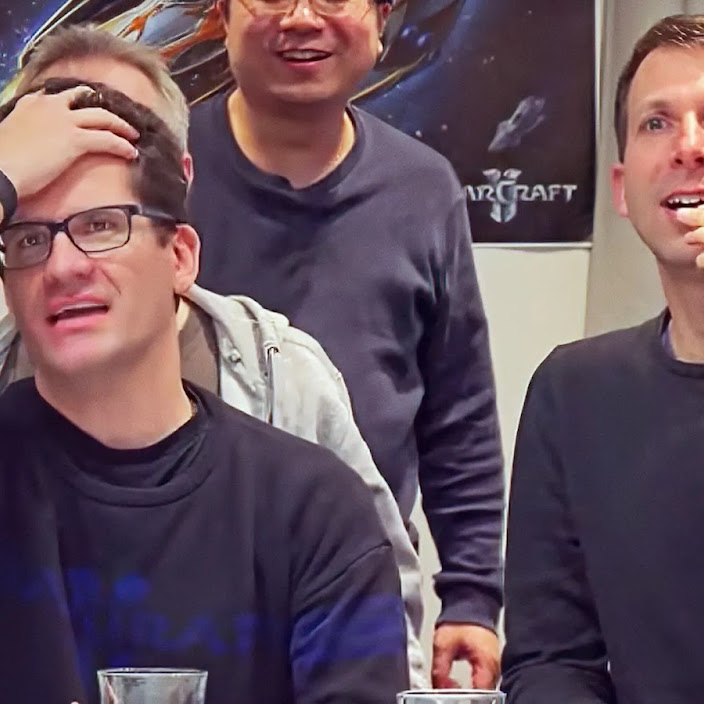
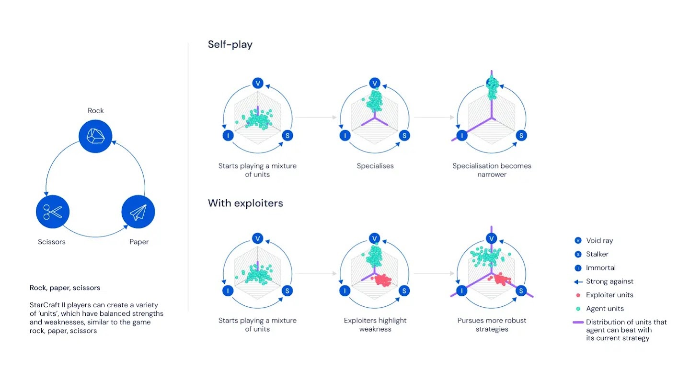
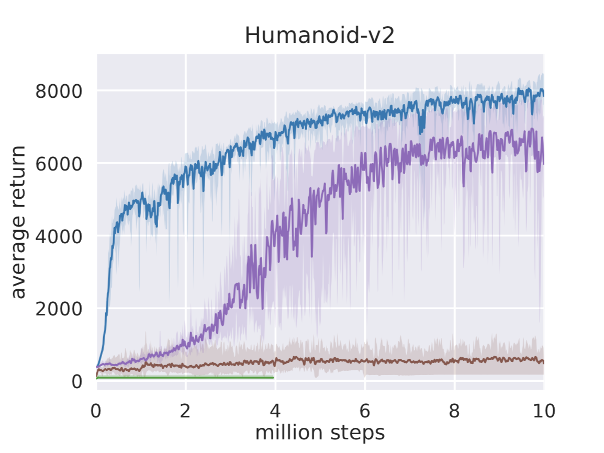

# 6.4 Actor-Critic 的前沿大规模应用

前面的实验都在 CartPole、LunarLander 这样的教学环境中完成——几十维状态、几维动作，CPU 上几分钟就能训完。但 Actor-Critic 架构的真正价值在于：**它可以从这些玩具任务扩展到工业级规模**。本节介绍三个里程碑式的大规模 Actor-Critic 应用，覆盖三个领域：游戏 AI、真实机器人、工业仿真平台。

| 应用             | 机构            | 领域                     | 规模                                |
| ---------------- | --------------- | ------------------------ | ----------------------------------- |
| AlphaStar        | DeepMind        | 星际争霸 II              | Grandmaster 级别，Top 0.2% 人类玩家 |
| SAC 真实机器人   | DeepMind / BAIR | 物理机器人抓取与灵巧操控 | 直接部署在真实机械臂上              |
| NVIDIA Isaac Lab | NVIDIA          | 机器人仿真训练平台       | GPU 加速，支持数千并行环境          |

## AlphaStar：用 Actor-Critic 打败星际争霸 Grandmaster

### 为什么星际争霸比围棋更难

AlphaGo 在 2016 年击败李世石，但星际争霸 II 对 AI 来说比围棋难得多。围棋是**完全信息博弈**：棋盘上所有信息对双方可见，状态可以用 19×19 的网格表示，每步在 361 个交叉点中选一个。星际争霸 II 则是**不完全信息博弈**：战争迷雾遮蔽了对手的行动，状态包含几百个单位的位置、血量、资源，动作需要先选择单位、再选择能力、再指定目标——组合后的动作空间约 $10^{26}$ 种。一局游戏持续约 10,000 步，远超围棋的 ~250 步。

  <em>图 1：AlphaStar 在星际争霸 II 中与人类职业选手 TLO 和 MaNa 对战。AlphaStar 使用摄像头视角接收游戏画面，通过 Actor-Critic 网络输出动作。来源：<a href="https://deepmind.google/blog/alphastar-grandmaster-level-in-starcraft-ii-using-multi-agent-reinforcement-learning/" target="_blank" rel="noopener noreferrer">DeepMind Blog</a></em>

2019 年，DeepMind 的 AlphaStar 成为第一个在星际争霸 II 中达到 Grandmaster 级别的 AI，在官方 Battle.net 排名中位居所有人类玩家的前 0.2% [^vinyals2019]。

### AlphaStar 的网络架构

AlphaStar 的核心就是一个大规模 Actor-Critic 系统。网络输入是游戏的原始特征（单位列表、小地图、建造队列、资源等），经过 Transformer torso 处理变长的实体集合，再通过 LSTM core 积累时序记忆，最后分两路输出。

  <em>图 2：AlphaStar 的完整网络架构。输入包括小地图（Minimap）、实体属性（Entity Properties）和标量统计（Scalar），经过 Transformer torso + LSTM core 后，策略头（Action Head）自回归地输出结构化动作，价值头（Value Head）输出胜率估计。来源：<a href="https://doi.org/10.1038/s41586-019-1724-z" target="_blank" rel="noopener noreferrer">Vinyals et al., 2019, Nature</a></em>

**Actor（策略网络）**输出结构化的动作序列。由于星际争霸的动作不是简单的"左/右"，Actor 使用**自回归策略头**（autoregressive policy head）：先选动作类型（move、attack、build...），再选执行单位，再选目标位置，每一步的条件概率串联起来形成完整的动作。

**Critic（价值网络）**输出一个标量 $V(s)$，评估当前局面的胜率。和本章学的 Critic 完全一样——只是输入从 4 维 CartPole 状态变成了几百维的游戏特征，网络参数量从几千增长到约 2 亿。

### 训练算法：V-trace Actor-Critic

AlphaStar 使用的训练算法是 **V-trace**，一种 off-policy 的 Actor-Critic 方法 [^espeholt2018]。

回顾本章的基本 Actor-Critic 更新：

$$\nabla_\theta J \approx \nabla_\theta \log \pi_\theta(a|s) \cdot \hat{A}(s,a)$$

其中优势 $\hat{A}(s,a)$ 用 TD Error 估计：$\hat{A}(s,a) = r + \gamma V(s') - V(s)$。

V-trace 的关键改进是处理 **off-policy** 数据。在星际争霸中，AlphaStar 同时维护一个联盟中的多个智能体，每个智能体用不同的策略风格对战。训练时，当前 Actor 可以从其他智能体（不同策略）产生的经验中学习。但不同策略产生的数据分布不同——V-trace 通过**重要性采样截断**来修正这个偏差：

$$v_s = V(s) + \sum_{t=s}^{s+n-1} \gamma^{t-s} \left(\prod_{k=s}^{t-1} \gamma c_k\right) \rho_t (r_t + \gamma V(s_{t+1}) - V(s_t))$$

其中 $\rho_t = \min\left(\bar{\rho}, \frac{\pi(a_t|s_t)}{\mu(a_t|s_t)}\right)$ 是截断的重要性采样比，$c_k = \min\left(\bar{c}, \frac{\pi(a_k|s_k)}{\mu(a_k|s_k)}\right)$ 是截断的自举权重。直觉上：V-trace 允许 Actor 从"别人"的经验中学习，但通过截断确保不会被与自己策略差异太大的数据带偏。

### 多智能体联盟训练

AlphaStar 最独特的创新是**联盟训练（League Training）**。联盟中维护了三类智能体：

- **Main Agent**：主智能体，目标是击败联盟中的所有对手
- **Main Exploiter**：专门找主智能体的弱点，迫使它补漏洞
- **League Exploiter**：在整个联盟中寻找无人能对付的策略盲区

  <em>图 3：AlphaStar 的联盟训练机制。三个种族（Protoss、Terran、Zerg）各有独立的 Main Agent，配合 Exploiter 智能体进行对抗训练。联盟中最终维护了约数百个不同的策略。来源：<a href="https://doi.org/10.1038/s41586-019-1724-z" target="_blank" rel="noopener noreferrer">Vinyals et al., 2019, Nature</a></em>

每个智能体都是一个独立的 Actor-Critic 网络。联盟中总共维护了约数百个不同的策略，累计进行了数亿局对战。这种训练方式让 AlphaStar 不会过度拟合某一种打法——它的策略必须是鲁棒的。

### 训练规模与关键结果

| 指标       | 数值                       |
| ---------- | -------------------------- |
| 训练时长   | 约 44 天                   |
| 并行 Actor | 数百万局同时进行           |
| 总对战局数 | 数亿局                     |
| 网络参数量 | 约 2 亿参数（单个智能体）  |
| TPU 消耗   | 相当于 12,000 年的游戏时间 |

AlphaStar 在三个种族对战中都达到了 Grandmaster 级别：对战人类职业选手的胜率约 90%+，在 Battle.net 排名中位居前 0.2%，展示了人类级别的微操（Micro）和宏观战略（Macro）。

  <em>图 4：AlphaStar 的训练曲线。横轴为训练时间，纵轴为 TrueSkill 评分。Main Agent（深色线）随训练持续提升，最终达到 Grandmaster 水平。来源：<a href="https://doi.org/10.1038/s41586-019-1724-z" target="_blank" rel="noopener noreferrer">Vinyals et al., 2019, Nature</a></em>

::: tip AlphaStar 与本章概念的对应
Actor = 策略网络（自回归策略头输出结构化动作），Critic = 价值网络（输出胜率 $V(s)$），优势估计 = V-trace TD Error，联盟训练 = 多个 Actor-Critic 实例互相博弈。整个系统就是本章学的 Actor-Critic 架构在大规模游戏 AI 中的工业级实现。
:::

**论文**：Vinyals, O., et al. (2019). Grandmaster level in StarCraft II using multi-agent reinforcement learning. _Nature_, 575, 350-354. [DOI](https://doi.org/10.1038/s41586-019-1724-z)

**代码**：[google-deepmind/alphastar](https://github.com/google-deepmind/alphastar) — DeepMind 官方 AlphaStar 训练框架（PyTorch + JAX）

**后续工作**：AlphaStar Unplugged (2023) 将 AlphaStar 扩展到离线 RL，建立了星际争霸 II 的离线 RL 基准 [^alphastar_unplugged]。

## SAC：Actor-Critic 从仿真走向真实机器人

### 为什么需要 SAC

本章学的 A2C 在 CartPole 上表现不错，但在真实机器人上会遇到两个问题：探索不足（确定性策略容易陷入局部最优）和样本效率低（真实机器人试错成本极高）。**SAC（Soft Actor-Critic）** [^haarnoja2018] 由 Tuomas Haarnoja 在 UC Berkeley 的 BAIR 实验室提出，核心思想是在 Actor-Critic 的目标函数中加入**熵正则项**：

$$J(\pi) = \mathbb{E}_{\pi} \left[ \sum_t \gamma^t \left( r(s_t, a_t) + \alpha \, \mathcal{H}(\pi(\cdot|s_t)) \right) \right]$$

其中 $r(s_t, a_t)$ 是环境奖励，$\mathcal{H}(\pi(\cdot|s_t)) = -\mathbb{E}_{a \sim \pi}[\log \pi(a|s)]$ 是策略的熵（衡量策略有多"随机"），$\alpha$ 是温度参数，控制"尽量拿高分"和"尽量多探索"的权衡。

SAC 不仅想让机器人拿到高奖励，还想让策略保持一定的随机性。这种随机性让机器人在遇到未知情况时不会卡死，而是能灵活应对——这对 sim-to-real 迁移至关重要。

### SAC 的双 Critic 架构

和本章学的 A2C 不同，SAC 使用两个独立的 Critic 网络（Twin Q-Networks）来估计动作价值 $Q(s,a)$，Actor 输出高斯分布的参数。

取两个 Critic 的最小值 $\min(Q_1, Q_2)$ 是为了防止 Q 值过高估计——过高估计会导致 Actor 过度自信，做出危险动作。

**Actor 更新**：最大化熵正则化的期望回报：

$$\nabla_\theta J(\pi_\theta) \approx \nabla_\theta \mathbb{E}_{s} \left[ \mathbb{E}_{a \sim \pi_\theta} \left[ \min_{i=1,2} Q_i(s,a) - \alpha \log \pi_\theta(a|s) \right] \right]$$

**Critic 更新**：最小化 Bellman 误差（目标包含熵项）：

$$\mathcal{L}(Q_i) = \mathbb{E} \left[ \left( Q_i(s,a) - \left( r + \gamma \min_{j=1,2} Q_j(s',a') - \alpha \log \pi(a'|s') \right) \right)^2 \right]$$

### 真实机器人上的成功案例

SAC 已经直接部署在物理机器人上，覆盖了多种任务：

  <em>图 5：SAC 训练的 Minitaur 四足机器人在真实地形上行走。策略仅在仿真中用 SAC 训练，然后直接迁移到物理机器人，无需微调。由于 SAC 的最大熵目标，策略天然对仿真与现实的差异具有鲁棒性。来源：<a href="http://bair.berkeley.edu/blog/2018/12/14/sac/" target="_blank" rel="noopener noreferrer">BAIR Blog</a></em>

| 任务         | 机器人       | 关键挑战              | 结果                         |
| ------------ | ------------ | --------------------- | ---------------------------- |
| 灵巧手旋转笔 | Shadow Hand  | 24 个自由度，极度精密 | 成功学会旋转，无需人类示范   |
| 机械臂抓取   | Sawyer       | 7 自由度，稀疏奖励    | 从随机策略到 90%+ 抓取成功率 |
| 四足行走     | ANYmal       | 12 个关节，动态平衡   | 学会多种步态，适应不同地形   |
| 门把手转动   | Franka Emika | 接触力控制，精细操作  | 学会自适应抓握和转动         |

这些任务的共同特点是：在仿真中用 SAC 训练，然后直接迁移到物理机器人上。SAC 的熵正则化让策略在仿真中覆盖了足够多的动作变体，使得 sim-to-real 迁移时策略对现实世界的噪声和不确定性有更好的鲁棒性。

### SAC 的 Benchmark 对比

BAIR 博客提供了 SAC 与 DDPG、TD3、PPO 在 MuJoCo 连续控制任务上的训练曲线对比。在 HalfCheetah 和 Humanoid 两个高维连续控制任务上，SAC（蓝色）在最终性能、样本效率和最差情况表现上均优于其他方法：

  <em>图 6：SAC（蓝色）在 HalfCheetah-v2 上的训练曲线。实线为 5 次实验的平均回报，阴影区域为最好和最差的情况。SAC 的样本效率明显高于 PPO 和 DDPG，且在不同随机种子下表现一致。来源：<a href="http://bair.berkeley.edu/blog/2018/12/14/sac/" target="_blank" rel="noopener noreferrer">BAIR Blog</a></em>

  <em>图 7：SAC 在 Humanoid-v2（17 自由度人形机器人）上的训练曲线。即使在高维动作空间中，SAC 仍保持稳定的收敛，且最差情况仍优于其他方法的平均表现。来源：<a href="http://bair.berkeley.edu/blog/2018/12/14/sac/" target="_blank" rel="noopener noreferrer">BAIR Blog</a></em>

::: tip SAC 与本章概念的对应
Actor = 高斯策略网络（输出 $\mu$ 和 $\sigma$），Critic = 双 Q 网络（$Q_1, Q_2$），优势估计 = $Q(s,a) - V(s)$ 中的 $Q$ 由 Critic 提供，熵正则化 = 强制保持探索。SAC 就是把本章学的 Actor-Critic 加上了熵正则化和双 Critic 两个工程改进。
:::

**论文**：

- Haarnoja, T., et al. (2018). Soft Actor-Critic: Off-Policy Maximum Entropy Deep RL with a Stochastic Actor. _ICML_. [arXiv](https://arxiv.org/abs/1801.01290)
- Haarnoja, T., et al. (2018). Soft Actor-Critic Algorithms and Applications. [arXiv](https://arxiv.org/abs/1812.05905)

**代码**：[rail-berkeley/softlearning](https://github.com/rail-berkeley/softlearning) — SAC 官方实现

**博客**：[Soft Actor-Critic: Deep RL with Real-World Robots](https://bair.berkeley.edu/blog/2018/12/14/sac/) — BAIR 官方博文

## NVIDIA Isaac Lab：工业级 Actor-Critic 训练平台

### 从单机实验到工业流水线

前几章的实验都是单个环境、单个策略网络、CPU 上跑。工业级机器人训练的需求完全不同：

| 需求       | 教学实验              | 工业级                                  |
| ---------- | --------------------- | --------------------------------------- |
| 并行环境数 | 1                     | 数千到数万                              |
| 物理仿真   | Gymnasium（简化物理） | GPU 加速刚体/柔体仿真                   |
| 场景多样性 | 固定参数              | 域随机化（颜色、光照、摩擦力、质量...） |
| 训练速度   | 几分钟                | 几小时到几天                            |
| 部署目标   | 看曲线                | 真实机器人                              |

NVIDIA Isaac Lab（原名 Isaac Orbit）就是为这个需求设计的。它是一个基于 Isaac Sim 的开源机器人学习框架，专门用于大规模 Actor-Critic 训练 [^mittal2023]。

  <em>图 8：NVIDIA Isaac Lab 平台。基于 Isaac Sim 的 GPU 加速物理仿真，支持数千个并行环境同时训练，覆盖从机械臂到四足机器人的多种任务。来源：<a href="https://github.com/isaac-sim/IsaacLab" target="_blank" rel="noopener noreferrer">NVIDIA Isaac Lab GitHub</a></em>

### 支持的机器人与算法

Isaac Lab 内置了多种机器人模型，覆盖从机械臂到四足到双足的全系列：

  <em>图 9：Isaac Lab 内置的任务和环境一览。覆盖机械臂操作、四足行走、双足运动、导航等多种机器人任务，每个任务都配有域随机化支持。来源：<a href="https://github.com/isaac-sim/IsaacLab" target="_blank" rel="noopener noreferrer">NVIDIA Isaac Lab GitHub</a></em>

| 机器人             | 类型           | 应用场景                     |
| ------------------ | -------------- | ---------------------------- |
| Franka Emika Panda | 7 自由度机械臂 | 抓取、装配、精细操作         |
| ANYmal             | 四足机器人     | 地形行走、搜救               |
| Unitree Go1/H1     | 四足/双足      | 动态运动、平衡               |
| Shadow Hand        | 灵巧手         | 精密操作（笔旋转、物体操纵） |

算法方面，Isaac Lab 集成了多个 RL 框架（rl_games、skrl、rlrig 等），支持 PPO、SAC、DDPG、TD3、A2C 等主流 Actor-Critic 算法。

### 域随机化：Sim-to-Real 的关键

仿真环境和真实世界之间总有差距——物理参数不准、传感器有噪声、光照会变化。Isaac Lab 通过**域随机化**来解决这个问题：在每次训练 episode 中随机化大量参数。

  <em>图 10：Isaac Lab 单 GPU 训练架构。环境在 GPU 上并行运行，Actor 和 Learner 通过 PyTorch 与 rl_games/skrl 集成进行策略优化，训练完成后策略可直接部署到真实机器人。来源：<a href="https://github.com/isaac-sim/IsaacLab" target="_blank" rel="noopener noreferrer">NVIDIA Isaac Lab GitHub</a></em>

域随机化的核心逻辑是：如果策略在训练时已经见识过各种"变体"环境，那它在真实世界的差异面前就不会手足无措。OpenAI 在 2019 年的灵巧手魔方项目中证明了这一点——通过大规模域随机化训练的策略可以直接从仿真迁移到真实 Shadow Hand。

### 训练规模与速度

| 指标         | 数值                          |
| ------------ | ----------------------------- |
| 并行环境数   | 单 GPU 上 2,000~16,000 个     |
| 物理步频率   | ~100,000 steps/秒（单 GPU）   |
| 典型训练时间 | 1-8 小时（取决于任务复杂度）  |
| GPU 支持     | NVIDIA RTX 3090 / A100 / H100 |

::: tip Isaac Lab 与本章概念的对应
它是把本章学的 Actor-Critic 从"单机 CartPole"扩展到"工业级机器人训练"的工程化平台。算法本身没有变（PPO、SAC 都是 AC），变的是训练规模、物理仿真精度和部署流程。Actor-Critic 的"一个网络做决策，一个网络做评估"这个分工，在 GPU 并行训练数千个环境时同样有效。
:::

**代码**：[isaac-sim/IsaacLab](https://github.com/isaac-sim/IsaacLab) — NVIDIA 官方开源项目（MIT License）

**文档**：[Isaac Lab Documentation](https://isaac-sim.github.io/IsaacLab/)

**论文**：Mittal, M., et al. (2023). Orbit: A Unified Simulation Framework for Interactive Robot Learning Environments. _IEEE RA-L_. [arXiv](https://arxiv.org/abs/2301.04195)

## 三个应用的对比

|                 | AlphaStar                | SAC 机器人                   | Isaac Lab                 |
| --------------- | ------------------------ | ---------------------------- | ------------------------- |
| **领域**        | 游戏 AI                  | 物理机器人                   | 仿真训练平台              |
| **AC 变体**     | V-trace off-policy AC    | 最大熵 AC（双 Q 网络）       | PPO / SAC / TD3 等多种    |
| **Actor 输出**  | 结构化动作序列（自回归） | 高斯分布（均值+标准差）      | 取决于算法和任务          |
| **Critic 输出** | $V(s)$（胜率）           | $Q_1(s,a), Q_2(s,a)$（双 Q） | $V(s)$ 或 $Q(s,a)$        |
| **训练规模**    | 数亿局，44 天            | 数百万步，数小时             | 数十亿步，数小时          |
| **关键创新**    | 多智能体联盟 + V-trace   | 熵正则化 + 双 Critic         | GPU 并行 + 域随机化       |
| **成果**        | Grandmaster 级别         | 真实机器人部署               | 工业级 sim-to-real 流水线 |

这三者的共同点是：**核心都是 Actor + Critic 的架构**。变化的是训练算法的细节（V-trace vs 熵正则化 vs 标准 PPO）、训练规模（单机 vs 数千 GPU 并行）和部署目标（游戏 vs 真实机器人）。Actor-Critic 架构之所以能从 CartPole 扩展到这些工业级应用，正是因为"一个网络做决策，一个网络做评估"这个分工会随规模增长而越来越有效。

下一节，让我们亲手在 Pendulum 上跑一个 Actor-Critic 实验：[动手：Pendulum 摆杆平衡](./pendulum)。

---

[^vinyals2019]: Vinyals, O., et al. (2019). Grandmaster level in StarCraft II using multi-agent reinforcement learning. _Nature_, 575, 350-354. [DOI](https://doi.org/10.1038/s41586-019-1724-z)

[^espeholt2018]: Espeholt, L., et al. (2018). IMPALA: Scalable Distributed Deep-RL with Importance Weighted Actor-Learner Architectures. _ICML_. [arXiv](https://arxiv.org/abs/1802.01561)

[^haarnoja2018]: Haarnoja, T., et al. (2018). Soft Actor-Critic: Off-Policy Maximum Entropy Deep Reinforcement Learning with a Stochastic Actor. _ICML_. [arXiv](https://arxiv.org/abs/1801.01290)

[^alphastar_unplugged]: AlphaStar Unplugged: Large-Scale Offline Reinforcement Learning. (2023). [arXiv](https://arxiv.org/abs/2308.03526)

[^mittal2023]: Mittal, M., et al. (2023). Orbit: A Unified Simulation Framework for Interactive Robot Learning Environments. _IEEE RA-L_. [arXiv](https://arxiv.org/abs/2301.04195)
