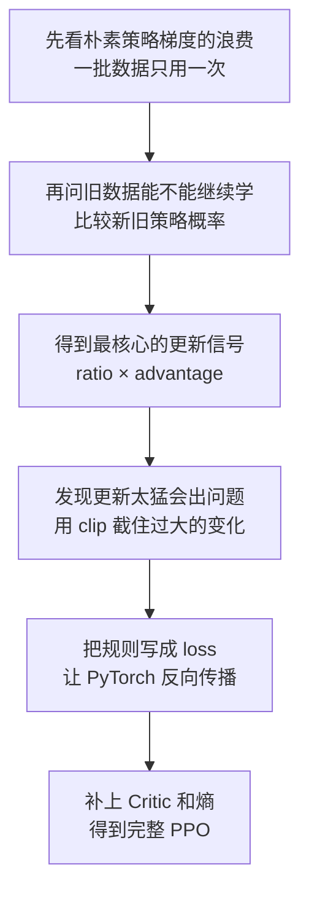
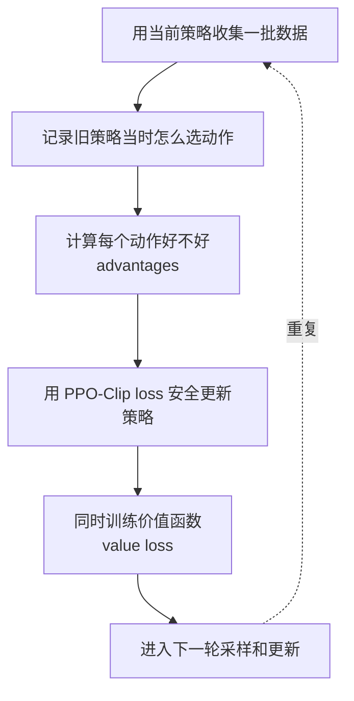
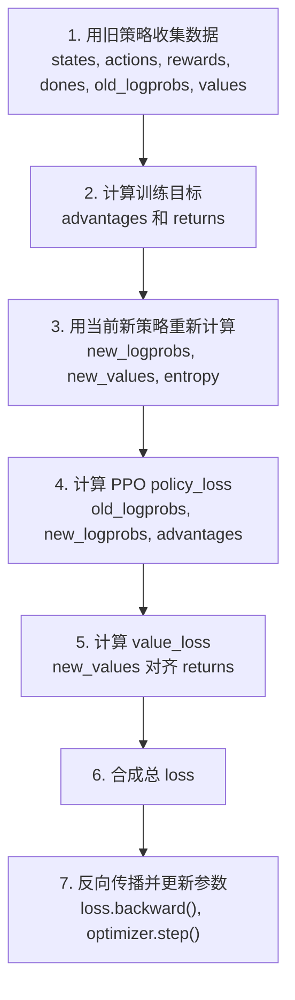
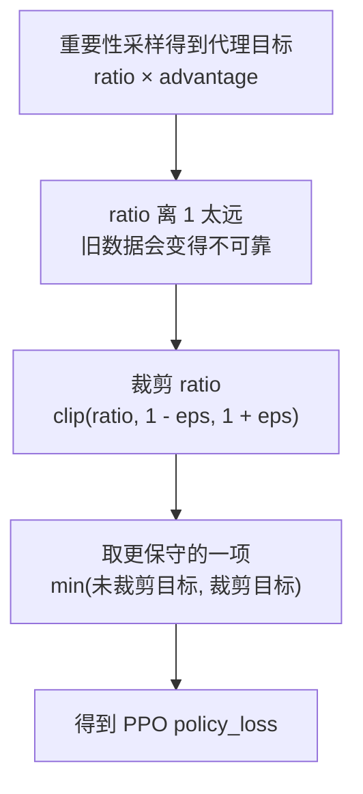
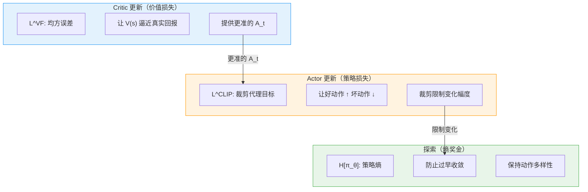
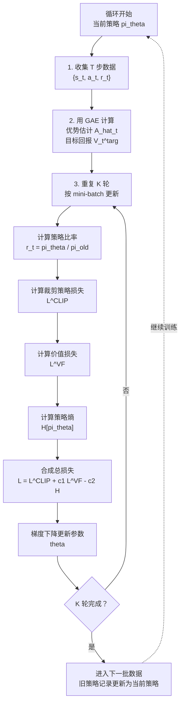
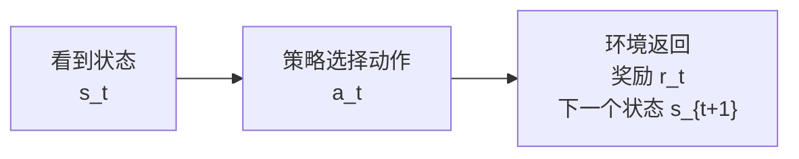

# 7.2 PPO 数学推导

上一节我们用 SB3 的 PPO 训练了月球着陆器，看到了 reward、entropy、clip fraction 这些曲线。接下来要回答一个更基础的问题：**PPO 到底是什么？为什么它最后会写成一个 loss？**

::: tip 本节前置知识
本节直接从 PPO 的推导起点出发，以下概念默认你已掌握（如需复习见[附录](#附录-从零推导策略梯度与优势函数)）：

- **策略梯度定理**：$\nabla_\theta J(\theta) = \mathbb{E}_t[\nabla_\theta \log \pi_\theta(a_t\mid s_t)\hat{A}_t]$
- **优势函数 $A_t$**：衡量动作比平均水平好多少，由 Critic 提供基线
- **Actor-Critic 框架**：Actor 选动作，Critic 估计状态价值
- **on-policy 限制**：朴素策略梯度要求数据来自当前策略，每批只能用一次
  :::

上一章的 Actor-Critic 已经能训练策略：Actor 负责选动作，Critic 负责评价状态，优势函数告诉 Actor 哪些动作应该更常选。这个框架能跑起来，但到了更复杂的任务，会遇到两个直接问题。

第一，**策略更新容易过猛**。如果某一批数据里某个动作表现很好，普通策略梯度可能一次性把这个动作概率推得很高；下一轮采样时，策略已经变得很不一样，训练可能震荡甚至崩掉。

第二，**采样数据很贵**。on-policy 策略梯度要求数据来自当前策略。按最朴素的做法，一批 rollout 用一次就丢掉，再重新采样。对于游戏模拟、机器人控制和 LLM 生成回答，这都很浪费。

PPO 就是为了解决这两个问题提出的：**同一批经验可以多学几轮，但每一轮都限制策略变化幅度。** 它不改变 Actor-Critic 的基本分工，只是在"怎么更新 Actor"这一步加了一套更稳的规则。

实际使用 PPO 时，流程通常是这样：


所以，PPO 不是一个新的环境，也不是一个新的网络结构。**PPO 是一种训练策略网络的方法**：它告诉我们怎样复用一批经验，怎样提高好动作的概率、降低坏动作的概率，以及每次更新最多能改多少。

被训练的对象是**策略（policy）**，记作：

$$
\pi_\theta(a \mid s)
$$

它表示"参数为 $\theta$ 的网络在状态 $s$ 下选择动作 $a$ 的概率"。代码里对应 Actor 的前向传播：输入状态，输出一组动作概率，再从中采样。PPO 的全称是 **Proximal Policy Optimization**，其中 **Proximal** 就是"新策略不要离旧策略太远"——这个要求最终会体现在 loss 的裁剪项里。

PPO 不是策略本身，而是一套训练它的方法。先分清三个容易混淆的概念：

| 名字               | 它是什么                                                   | 代码里大概对应什么                         |
| ------------------ | ---------------------------------------------------------- | ------------------------------------------ |
| **策略（policy）** | 被训练的对象，负责根据状态选择动作                         | `actor` / `model` 输出的 `action_probs`    |
| **PPO**            | 训练策略的方法，规定如何采样、计算优势、限制更新、反向传播 | 整个训练循环                               |
| **PPO loss**       | PPO 方法中用于更新神经网络参数的可求导目标                 | `policy_loss + value_loss - entropy_bonus` |

后文要推导的核心是 **PPO loss**。为什么是 loss 而不是别的？因为 PPO 的设计原则——复用旧数据、限制策略变化、平衡探索与利用——都是直觉层面的约束，而优化器只认梯度，梯度只能从 loss 出发。所以 PPO loss 做的事情，就是把这些原则翻译成 PyTorch 能 `backward()` 的数学表达式：ratio × advantage 处理旧数据复用，clip 处理策略变化限制。后文的推导，就是在看这两条原则怎样一步步变成可计算的公式。

## PPO 代码骨架

为了让后面的公式不悬空，我们先把 **PPO 在代码里大概长什么样**放在这里。下面这份代码不是工程性能版，而是一份适合学习的 **最小 PyTorch PPO 骨架**：它包含策略网络、采样、优势估计、PPO-Clip 损失、价值函数损失、熵奖金和多轮更新。

后文每推到一个公式，都会回到这份代码里的某一段。代码块中带底色的部分，就是后面会反复拆开的核心行。可以先不用完全读懂每一行，只要先记住：**PPO 最终就是把"收集经验、计算优势、限制策略变化、反向传播更新参数"连成一个训练循环。**

<PpoCodeFocus focus="overview" />

这份代码可以分成六块：

| 标记    | 代码部分           | 后文会解释什么                                             |
| ------- | ------------------ | ---------------------------------------------------------- |
| **[A]** | `forward`          | 策略 $\pi_\theta(a\mid s)$ 和价值函数 $V_\theta(s)$ 是什么 |
| **[B]** | `act` / `evaluate` | 为什么要构造 `dist`，以及为什么要保存 `log_prob`           |
| **[C]** | `collect_rollout`  | 什么叫 on-policy 数据，为什么要记录旧策略概率              |
| **[D]** | `compute_gae`      | 回报、价值函数、优势函数之间是什么关系                     |
| **[E]** | `ppo_update`       | PPO-Clip 的 `ratio`、`clamp`、`min` 和总损失               |
| **[F]** | 训练循环           | 为什么同一批数据会更新多轮                                 |

后文遇到关键变量时，会反复出现这个 **代码透镜**。它默认只显示当前段落关心的代码，并把关键行加粗加深；鼠标移上去或点击按钮后，会展开同一份完整代码。这样读者既能专心看局部，又不会忘记这几行在整个 PPO 程序里的位置。

本节的推导路径如下：



等这些步骤走完之后，再看 PPO 的最终公式就不会像从天上掉下来：

$$
L^{\text{CLIP}}(\theta)
= \mathbb{E}_t\left[
\min\left(
r_t(\theta)\hat{A}_t,\;
\text{clip}(r_t(\theta),1-\varepsilon,1+\varepsilon)\hat{A}_t
\right)
\right]
$$

现在先把**主要符号**放在一张表里。后文每个公式都会再次解释这些字母，这张表可以当作索引。

| 符号                         | 含义                                                   | 代码里的对应物                           |
| ---------------------------- | ------------------------------------------------------ | ---------------------------------------- |
| $s_t$                        | 第 $t$ 步的状态，例如 CartPole 的位置、速度等观测      | `state` / `obs`                          |
| $a_t$                        | 第 $t$ 步采取的动作                                    | `action`                                 |
| $r_t$                        | 执行动作后环境返回的即时奖励                           | `reward`                                 |
| $\gamma$                     | 折扣因子，控制未来奖励的重要程度                       | `gamma`，常用 `0.99`                     |
| $G_t$                        | 从第 $t$ 步开始的折扣累计回报                          | `returns`                                |
| $\tau$                       | 一整条轨迹：状态、动作、奖励组成的序列                 | rollout / trajectory                     |
| $\pi_\theta(a \mid s)$       | 参数为 $\theta$ 的策略，在状态 $s$ 选择动作 $a$ 的概率 | `action_probs`                           |
| $\log \pi_\theta(a \mid s)$  | 动作概率的对数，用来稳定计算策略梯度                   | `log_prob` / `new_logprobs`              |
| $J(\theta)$                  | 策略的总体目标：期望折扣累计回报                       | 训练时希望最大化的目标                   |
| $V_\theta(s)$                | Critic 对状态 $s$ 未来回报的估计                       | `value` / `new_values`                   |
| $A_t$ 或 $\hat{A}_t$         | 优势估计：这个动作比当前状态的平均水平好多少           | `advantages`                             |
| $\pi_{\text{old}}(a \mid s)$ | 收集这批数据时的旧策略                                 | 存下来的 `old_logprobs`                  |
| $r_t(\theta)$                | 新旧策略概率比值 $\pi_\theta / \pi_{\text{old}}$       | `ratio = exp(new_logprobs-old_logprobs)` |
| $\varepsilon$                | PPO 裁剪范围，通常取 `0.1` 或 `0.2`                    | `clip_eps` / `clip_range`                |
| $H[\pi_\theta]$              | 策略熵，衡量动作分布有多随机                           | `entropy`                                |

## 出发点：一批经验能不能多学几遍

Actor-Critic 策略梯度已经有了一个看起来完整的训练流程：用当前策略采样 → 计算优势 → 用 $\log \pi_\theta(a_t\mid s_t)\hat{A}_t$ 更新策略（如果你对这些概念还不熟悉，可以前往[附录](#附录-从零推导策略梯度与优势函数)复习）。


问题在于，这个流程有一个硬性要求：**用来更新策略的数据，最好就是这个策略自己刚刚采样出来的数据。** 这个性质叫做 **on-policy**。公式里的期望是 $\mathbb{E}_{\tau\sim\pi_\theta}[\cdots]$，意味着数据应该来自**当前策略** $\pi_\theta$。可是一次梯度更新之后，参数从 $\theta_{\text{old}}$ 变成 $\theta$，刚刚收集的轨迹就不再来自新策略了，而是来自**旧策略** $\pi_{\text{old}}$。

这就像你打了一局游戏，录下每一步怎么操作、最后得了多少分。照朴素策略梯度的做法，这段录像只能看一遍，看完就丢掉，然后必须重新打一局。这样当然能学，但很浪费。跑环境收集 2048 步数据很贵，尤其是在机器人、游戏模拟、LLM 生成回答这类场景里。我们自然想问：

> 能不能用旧策略收集的数据，对新策略更新多轮？

PPO 的核心矛盾就在这里：**我们想复用旧数据提高样本效率，但又不能让新策略离旧策略太远，否则旧数据会误导更新。**

在学习版 PPO 骨架的 `collect_rollout` 函数中，代码特意把采样当时的 log 概率存下来：

<PpoCodeFocus focus="oldLogprobs" />

这个 `old_logprobs` 就是 $\log \pi_{\text{old}}(a_t\mid s_t)$。后面更新时，模型会重新计算同一批状态动作对在新策略下的 `new_logprobs`。新旧 log 概率一比较，就能知道策略偏离了多少。接下来的重要性采样正是为了解开"旧数据能不能继续用"这个结。

## 第一步：重要性采样

先不要把"重要性采样"当成一个新算法。它在这里只解决一个很具体的问题：

> 这批动作是旧策略选出来的，但我现在想训练新策略。旧数据还能不能算数？

答案是：可以，但要给每个样本乘一个**修正权重**。这个权重不是凭空来的，而是新旧策略对同一个动作的概率比。

### 1.1 从一个动作概率例子开始

假设在某个状态 $s_t$，旧策略对三个动作的概率是：

| 动作 | 旧策略概率 $\pi_{\text{old}}(a\mid s_t)$ | 新策略概率 $\pi_\theta(a\mid s_t)$ | 比率 $r=\pi_\theta/\pi_{\text{old}}$ |
| ---- | ---------------------------------------- | ---------------------------------- | ------------------------------------ |
| 左   | 0.50                                     | 0.25                               | 0.5                                  |
| 右   | 0.25                                     | 0.50                               | 2.0                                  |
| 停   | 0.25                                     | 0.25                               | 1.0                                  |

现在旧策略采样到了一次"右"，而且这次动作的优势 $A_t$ 是正的，说明它是好动作。新策略比旧策略更喜欢"右"：旧策略概率是 0.25，新策略概率是 0.50，所以比率是 2.0。这个旧样本对新策略来说更"重要"，更新时应该乘上 2.0。

如果旧策略采样到的是"左"，新策略已经不太想选它了：旧策略概率是 0.50，新策略概率是 0.25，比率是 0.5。这个样本对新策略来说权重就应该降低。

这就是重要性采样在 PPO 里的直觉：**旧数据不是直接照搬，而是按"新策略有多认同这个动作"重新加权。**

### 1.2 策略比率

把上面的权重写成公式，就是**策略比率**（Policy Ratio）：

$$r_t(\theta) = \frac{\pi_\theta(a_t | s_t)}{\pi_{\text{old}}(a_t | s_t)}$$

在代码中，策略比率通过 log 概率之差的指数来计算，这是为了避免直接做除法导致数值下溢：

<PpoCodeFocus focus="ratio" />

**$r_t = 1$ 表示新策略和旧策略在这个动作上概率相同**；$r_t > 1$ 表示新策略更倾向于选这个动作；$r_t < 1$ 则相反。

背后的恒等式可以写成：

$$
\mathbb{E}_{a \sim \pi_\theta} [f(a)]
=
\mathbb{E}_{a \sim \pi_{\text{old}}}
\left[
\frac{\pi_\theta(a\mid s)}{\pi_{\text{old}}(a\mid s)}
f(a)
\right]
$$

它的意思是：如果我们手里只有旧策略采出来的样本，也可以通过乘上 $\pi_\theta/\pi_{\text{old}}$，去估计新策略下的平均效果。这个公式就是"旧数据还能继续用"的数学理由。

### 1.3 代理目标

策略更新时，$f(a)$ 对应的就是这个动作的优势 $A_t$。于是旧数据上的训练信号变成：

$$L^{\text{IS}}(\theta) = \mathbb{E}_t \left[ r_t(\theta) \cdot A_t \right]$$

展开写就是：

$$L^{\text{IS}}(\theta) = \mathbb{E}_t \left[ \frac{\pi_\theta(a_t | s_t)}{\pi_{\text{old}}(a_t | s_t)} \cdot A_t \right]$$

代码中对应的是 `surr1 = ratio * advantages`，它在 PPO 更新函数里紧跟着 `ratio`：

<PpoCodeFocus focus="surr1" />

这个式子可以直接读成一句话：

> 一个动作应该给多大更新，不只看它好不好（$A_t$），还要看新策略相对旧策略有多想选它（$r_t$）。

这就是**代理目标**（Surrogate Objective）。它不是直接用新策略重新采样，而是用旧数据加权后，临时代理新策略的训练目标。

如果新策略和旧策略还很接近，这个代理目标是可信的；但如果新策略已经改得很远，比率 $r_t$ 可能变得很大或很小，旧数据就开始不能代表新策略了。**PPO 的 clip 正是为了处理这个危险。**

## 第二步：从代理目标直接得到 PPO-Clip

现在我们已经有了一个很自然的更新信号：

$$
L^{\text{IS}}(\theta)
= \mathbb{E}_t[r_t(\theta)A_t]
$$

先把它翻译成人话：**优势 $A_t$ 决定这个动作该被鼓励还是抑制，策略比率 $r_t$ 决定新策略相对旧策略已经改了多少。**

| 名称     | 数学符号             | 代码变量     | 它回答的问题                     |
| -------- | -------------------- | ------------ | -------------------------------- |
| 策略比率 | $r_t(\theta)$        | `ratio`      | 新策略比旧策略更想选这个动作吗？ |
| 优势     | $A_t$ 或 $\hat{A}_t$ | `advantages` | 这个动作比平均水平好吗？         |

如果没有任何限制，我们会直接最大化：

$$
r_t(\theta)A_t
$$

代码里就是 `surr1 = ratio * advantages`：

<PpoCodeFocus focus="surr1" />

这里的 `surr1` 可以理解为 **"不加刹车的策略改进目标"**。它的规则很简单：

- 如果 $A_t>0$，说明这是好动作，希望提高它的概率，也就是让 $r_t$ 变大。
- 如果 $A_t<0$，说明这是坏动作，希望降低它的概率，也就是让 $r_t$ 变小。

问题是，这个目标本身**太贪心**。假设某个动作的优势 $A_t=+2$，当前策略比率 $r_t=5$，那么 $r_tA_t=10$。如果继续把这个动作概率推高，让 $r_t$ 变成 10、50、100，目标值会继续变大。优化器会以为"越大越好"。

但别忘了，这批数据是旧策略采出来的。当 $r_t=5$ 时，新策略选择这个动作的概率已经是旧策略的 5 倍；这时还根据旧数据继续猛推，就像拿一份旧地图开到很远的地方，地图开始不可靠了。

**PPO 的做法不是重新设计一个复杂算法，而是在这个目标上加一个很直接的规则：**

> 可以提高好动作的概率，也可以降低坏动作的概率；但不要让新策略相对旧策略变化太多。

于是我们把**策略比率限制在一个小区间里**：

$$
\overline{r}_t(\theta)
= \text{clip}(r_t(\theta), 1-\varepsilon, 1+\varepsilon)
$$

如果 $\varepsilon=0.2$，那么区间就是 $[0.8, 1.2]$。这表示：对这批旧数据里的某个动作，新策略给它的概率最好不要低于旧策略的 0.8 倍，也不要高于旧策略的 1.2 倍。

代码里会把未裁剪目标 `surr1`、裁剪后的 `surr2` 和最终 `policy_loss` 放在一起：

<PpoCodeFocus focus="clip" title="裁剪代理目标 surr2 和 PPO-Clip" />

于是同一个样本会产生两个目标：

| 代码    | 数学                                                      | 含义                                 |
| ------- | --------------------------------------------------------- | ------------------------------------ |
| `surr1` | $r_t(\theta)A_t$                                          | 不加限制时，策略想怎么改             |
| `surr2` | $\text{clip}(r_t(\theta),1-\varepsilon,1+\varepsilon)A_t$ | 加上更新幅度限制后，最多允许改到哪里 |

为什么最后取二者较小值？因为 PPO 想让目标保持保守：如果未裁剪目标还在安全范围内，就正常学习；如果未裁剪目标试图从旧数据里榨出过大的更新，就用裁剪项把收益截住。

写成公式就是：

$$
J^{\text{CLIP}}(\theta)
= \mathbb{E}_t
\left[
\min \left(
r_t(\theta)A_t,\;
\text{clip}(r_t(\theta),1-\varepsilon,1+\varepsilon)A_t
\right)
\right]
$$

**这就是 PPO-Clip。** 它可以理解成一句训练规则：用旧数据多学几遍可以，但每次更新都要检查新策略有没有离旧策略太远；离得太远的那部分，不再给额外奖励。

也就是代码里的 `torch.min(surr1, surr2).mean()`。这一步得到的是一个想要**最大化**的策略目标；但 **PyTorch 优化器默认最小化 loss**，所以代码最后写成 `policy_loss = -policy_objective`。

### 裁剪效果分析

**情况一：$A_t > 0$（好动作，应该增加概率）**

当 $A_t > 0$ 时，我们希望 $r_t$ 变大（即 $\pi_\theta$ 增加该动作的概率）。未裁剪项 $r_t \cdot A_t$ 会随 $r_t$ 线性增长，没有上限。裁剪项 $\overline{r}_t \cdot A_t$ 在 $r_t > 1+\varepsilon$ 后被截断为常数 $(1+\varepsilon) \cdot A_t$。

| $r_t$ 的范围               | 未裁剪项 $r_t \cdot A_t$ | 裁剪项 $\overline{r}_t \cdot A_t$   | $\min$ 取哪个    |
| -------------------------- | ------------------------ | ----------------------------------- | ---------------- |
| $r_t \leq 1 + \varepsilon$ | $r_t \cdot A_t$          | $r_t \cdot A_t$                     | 相等，正常优化   |
| $r_t > 1 + \varepsilon$    | $r_t \cdot A_t$（更大）  | $(1+\varepsilon) \cdot A_t$（常数） | 裁剪项，梯度为零 |

好动作的概率可以增加，但**最多增到 $1 + \varepsilon$ 倍**。超过之后目标函数"变平"——不再提供继续增大的动力，梯度为零，参数不会被进一步推动。

**情况二：$A_t < 0$（坏动作，应该降低概率）**

当 $A_t < 0$ 时，我们希望 $r_t$ 变小（即 $\pi_\theta$ 降低该动作的概率）。但是如果 $r_t$ 已经小于 $1-\varepsilon$，说明新策略已经把这个坏动作的概率压得太低了，PPO 不再奖励继续压低。

注意这里最容易看错，因为 $A_t$ 是负数。举个数值例子：令 $A_t=-2$，$\varepsilon=0.2$。如果 $r_t=0.7$，未裁剪项是 $0.7\times(-2)=-1.4$；裁剪项是 $0.8\times(-2)=-1.6$。$\min$ 会选择更小的 $-1.6$，也就是裁剪项。裁剪项已经是常数，所以梯度为零。

| $r_t$ 的范围               | 未裁剪项 $r_t \cdot A_t$  | 裁剪项 $\overline{r}_t \cdot A_t$   | $\min$ 取哪个          |
| -------------------------- | ------------------------- | ----------------------------------- | ---------------------- |
| $r_t < 1 - \varepsilon$    | 比裁剪项更大，例如 $-1.4$ | $(1-\varepsilon) \cdot A_t$（常数） | 裁剪项，梯度为零       |
| $r_t \geq 1 - \varepsilon$ | 未裁剪项                  | 区间内相等，过高时裁剪项反而更大    | 未裁剪项，继续正常优化 |

坏动作的概率可以降低，但**最多降到旧策略的 $1-\varepsilon$ 倍附近**。超过之后目标函数变平，不再提供继续压低概率的动力。如果坏动作概率反而升高，未裁剪项会让目标变差，梯度会把它往回拉。

**情况三：$A_t = 0$（中性动作）**。此时 $r_t \cdot A_t = 0$，无论 $r_t$ 如何变化，目标值始终为 0。PPO 对中性动作不做任何调整。

把这三种情况合起来看，PPO-Clip 的意义就很清楚：**它不是不让策略学习，而是不再奖励"已经走太远"的那部分变化。**

```python
import numpy as np
import matplotlib.pyplot as plt

# ==========================================
# PPO-Clip 目标函数的几何直觉
# ==========================================
epsilon = 0.2
r = np.linspace(0.0, 2.0, 500)

def clip_objective(r, A, eps=0.2):
    r_clipped = np.clip(r, 1 - eps, 1 + eps)
    return np.minimum(r * A, r_clipped * A)

fig, axes = plt.subplots(1, 3, figsize=(15, 4))

for ax, (A_val, title) in zip(axes, [
    (1.0, "A > 0 (好动作)"),
    (-1.0, "A < 0 (坏动作)"),
    (0.0, "A = 0 (中性动作)")
]):
    obj = clip_objective(r, A_val)
    ax.plot(r, r * A_val, 'b--', alpha=0.4, label='未裁剪 r·A')
    ax.plot(r, obj, 'r-', linewidth=2, label='PPO-Clip min(...)')
    ax.axvspan(1 - epsilon, 1 + epsilon, alpha=0.1, color='green', label='安全区间')
    ax.set_title(title)
    ax.set_xlabel('策略比率 r_t(θ)')
    ax.set_ylabel('目标值')
    ax.legend(fontsize=8)

plt.suptitle('PPO-Clip 目标函数的三种情况 (ε=0.2)', fontsize=13)
plt.tight_layout()
plt.savefig("ppo_clip_three_cases.png", dpi=150)
print("可视化已保存")
```

### 裁剪的直觉

把三种情况放在一起看，PPO-Clip 的设计意图就很清晰：


**$\varepsilon = 0.2$ 意味着在这批旧数据上，PPO 只奖励新策略在旧策略附近的小幅改进。** 这个限制不是为了阻止学习，而是为了让多轮学习仍然可信。

## 第三步：从 PPO-Clip 到真正的 loss

到这里，我们已经得到 PPO 最重要的策略更新规则。但代码还不能只停在"规则"上。神经网络训练需要一个标量 loss，优化器只会做一件事：最小化这个 loss。

所以要把 PPO-Clip 落到代码里，只需要完成一次翻译：

| 数学想做什么                | 代码怎么写                                      |
| --------------------------- | ----------------------------------------------- |
| 最大化裁剪代理目标          | `policy_objective = torch.min(surr1, surr2).mean()` |
| PyTorch 默认最小化 loss     | `policy_loss = -policy_objective`               |
| 同时训练 Critic             | 加上 `vf_coef * value_loss`                     |
| 保持探索，不要过早确定动作  | 减去 `ent_coef * entropy_bonus`                 |

这就是为什么 PPO 最后会写成：

```python
loss = policy_loss + vf_coef * value_loss - ent_coef * entropy_bonus
```

其中三项分别负责三件事：

| PPO 里的部分   | 它做什么                                       | 代码里的体现                      |
| -------------- | ---------------------------------------------- | --------------------------------- |
| 裁剪策略更新   | 更新 Actor，但限制新策略不要离旧策略太远       | `ppo_clip_loss(...)`              |
| 价值函数训练   | 训练 Critic，让它更会估计状态价值              | `value_loss`                      |
| 熵奖励         | 保持一定探索，不要过早变得太确定               | `entropy_bonus`                   |

其中 `policy_loss` 是主角。它告诉 Actor：哪些动作概率该提高，哪些该降低，以及变化最多到哪里。`value_loss` 训练 Critic，让优势估计更准。`entropy_bonus` 防止策略太早变成"永远只选一个动作"。

但也要注意：**PPO loss 仍然不是 PPO 的全部。** 它只是 PPO 这套训练流程里真正作用到参数上的那一部分。完整 PPO 还包括采样、记录旧概率、计算优势、同一批数据多轮 mini-batch 更新。

可以把 PPO 理解成一个训练协议：



这条链路才是 PPO 的完整叙事：**旧数据可以复用，但要用 ratio 校正；ratio 不能跑太远，所以要 clip；clip 规则要训练网络，所以写成 loss。**

## 第四步：PPO 的代码体现

如果只保留 PPO **最核心的策略更新**，落点就是下面这几行：

<PpoCodeFocus focus="clip" title="PPO 在代码里的核心落点" />

这段代码需要三个主要输入：

| 输入           | 从哪里来                   | 作用                               |
| -------------- | -------------------------- | ---------------------------------- |
| `old_logprobs` | 收集轨迹时保存             | 记录旧策略当时给动作的概率         |
| `new_logprobs` | 更新时重新用模型计算       | 表示当前新策略给同一动作的概率     |
| `advantages`   | 由回报、Critic 或 GAE 得到 | 告诉策略这个动作应该被鼓励还是抑制 |

它输出一个标量 `policy_loss`。**这个标量就是可以拿去做反向传播的东西**：

<PpoCodeFocus focus="loss" />

当然，真实 PPO 不只训练 Actor，还要训练 Critic，并且通常会加一个熵奖金鼓励探索。因此实际训练时会把 `policy_loss` 放进完整损失函数：`loss = policy_loss + vf_coef * value_loss - ent_coef * entropy_bonus`。

所以，如果你已经自己推导出了 PPO，要开始写代码，**只需要按这个顺序把数据接起来**：



**这就是 PPO 从公式变成训练程序的最小闭环。**

<details>
<summary>补充：TRPO 是历史背景，不是必经推导</summary>

TRPO（Trust Region Policy Optimization）和 PPO 解决的是同一个问题：策略更新不能太大。TRPO 的写法是：

$$
\max_\theta L^{\text{IS}}(\theta)
\quad \text{s.t.} \quad
\bar{D}_{\text{KL}}(\theta_{\text{old}}, \theta) \leq \delta
$$

这句话的意思是：可以优化代理目标，但新旧策略之间的平均 KL 散度不能超过一个小阈值 $\delta$。

这条路在理论上很漂亮，但实现起来需要约束优化、共轭梯度、近似二阶信息等步骤。对于一篇想让读者"从公式写出 PPO loss"的文章来说，**TRPO 不是必要前提**。你可以把它当作一句历史说明：

> TRPO 用 KL 约束来限制策略变化；PPO 用裁剪策略比率来近似达到类似效果。

也就是说，主线应该是：



TRPO 只是在旁边提醒我们：PPO 的 "Proximal" 来自信任域思想，但写代码时你真正需要落地的是 **`ratio`、`clamp`、`min` 和总损失**。

</details>

## 第五步：PPO 的完整损失函数

实际训练中，PPO 不只优化裁剪代理目标，还要同时训练 Critic，并保留一定探索。为了避免符号混乱，先**区分两个东西**：

- $J^{\text{PPO}}(\theta)$：数学上要最大化的目标。
- `loss`：代码里要最小化的训练损失。

最大化目标可以写成：

$$
J^{\text{PPO}}(\theta)
= J^{\text{CLIP}}(\theta)
- c_1 L^{\text{VF}}(\theta)
+ c_2 H[\pi_\theta]
$$

其中 $J^{\text{CLIP}}$ 是**策略改进目标**，$L^{\text{VF}}$ 是 **Critic 的价值误差**，$H[\pi_\theta]$ 是**策略熵**。代码要最小化，所以会把策略目标和熵项取负：

对应代码中的总损失计算：

<PpoCodeFocus focus="loss" title="价值损失、熵奖金和总 loss" />

### 策略损失

策略最大化目标是上面推导的裁剪代理目标：

$$
J^{\text{CLIP}}(\theta)
= \mathbb{E}_t
\left[
\min \left(
r_t(\theta) \cdot A_t,\;
\overline{r}_t(\theta) \cdot A_t
\right)
\right]
$$

代码中的 `policy_loss` 是它的相反数：

$$
L^{\text{policy}}(\theta)
= -J^{\text{CLIP}}(\theta)
$$

这一项负责调整 Actor 的参数——**让好动作的概率上升、坏动作的概率下降**，但变化幅度被裁剪机制限制在安全范围内。

### 价值函数损失

Critic 需要准确估计状态价值。价值损失是 Critic 的预测值 $V_\theta(s_t)$ 与目标回报 $V_t^{\text{targ}}$ 之间的均方误差：

$$L^{\text{VF}}(\theta) = \mathbb{E}_t \left[ \left( V_\theta(s_t) - V_t^{\text{targ}} \right)^2 \right]$$

其中 $V_t^{\text{targ}}$ 由 GAE 计算得到（下一节详细推导 GAE）。

为什么需要单独的价值损失？**Critic 的准确性直接影响优势估计 $A_t$ 的质量。** 如果 Critic 预测不准，$A_t$ 就会包含很大的偏差，进而误导 Actor 的更新方向。均方误差损失让 Critic 不断修正自己的预测，使其更接近真实的回报。

代码中就是 `value_loss = F.mse_loss(new_values, returns[mb])`。它和 `policy_loss` 在同一个更新函数里一起反向传播。

### 熵奖金

策略熵鼓励探索，防止策略过早收敛到确定性策略：

$$H[\pi_\theta] = -\mathbb{E}_t \left[ \sum_a \pi_\theta(a|s_t) \log \pi_\theta(a|s_t) \right]$$

**熵越高，策略越"犹豫"（动作分布越均匀），探索越充分；熵越低，策略越"确定"（总是选同一个动作），探索越少。** 系数 $c_2$ 通常取 0.01。

为什么需要熵奖金？PPO 的裁剪机制会限制策略的变化幅度，这在稳定训练的同时也有一个副作用——策略可能过早地"锁定"在某个次优动作上。熵奖金通过在损失函数中奖励不确定性，确保策略始终保留一定的探索动力。这就像在学习过程中始终保持好奇心——即使你已经找到了一个还不错的方法，也要偶尔尝试其他可能性。

代码中是 `entropy_bonus = entropy.mean()`。注意总损失里是减号：`- ent_coef * entropy_bonus`，因为我们要**最大化熵**，等价于在最小化 loss 时减去这一项。

### 三项损失的协作关系



三项损失各司其职：**策略损失驱动 Actor 改进，价值损失确保 Critic 提供准确的优势信号，熵奖金保持探索活力。** 它们通过共享参数的 Actor-Critic 网络协同工作——在 [ppo_from_scratch.py](../../code/chapter07_ppo/ppo_from_scratch.py) 中，Actor 和 Critic 共享同一个主干网络（`shared_net`），所以一次反向传播同时更新两者的参数。

### 超参数总结

| 符号          | 名称         | 典型值  | 作用                       | 代码参数     |
| ------------- | ------------ | ------- | -------------------------- | ------------ |
| $\varepsilon$ | 裁剪范围     | 0.1–0.2 | 限制策略比率的变化范围     | `clip_range` |
| $c_1$         | 价值损失系数 | 0.5     | 平衡策略更新和价值函数拟合 | `vf_coef`    |
| $c_2$         | 熵奖金系数   | 0.01    | 鼓励探索                   | `ent_coef`   |
| $\gamma$      | 折扣因子     | 0.99    | 未来奖励的衰减速度         | `gamma`      |
| $\lambda$     | GAE 参数     | 0.95    | 优势估计中偏差-方差的权衡  | `gae_lambda` |
| $T$           | rollout 长度 | 2048    | 每次收集多少步数据         | `n_steps`    |
| $K$           | epoch 数     | 10      | 同一批数据更新几轮         | `n_epochs`   |

## 第六步：PPO 完整算法

把所有组件组装起来，**PPO 的训练循环**如下：



对照代码中的实现，每一步都可以找到对应的代码行：

<PpoCodeFocus focus="overview" title="完整 PPO 训练程序回看" />

几个**关键设计决策**的直觉：

- **重复利用数据 K 轮**：收集一次数据很贵（需要跑环境），所以用同一批数据更新多次。裁剪机制保证多轮更新不会让策略跑偏。
- **Mini-batch 更新**：把 $T$ 步数据分成若干 mini-batch，每个 mini-batch 独立计算梯度，提高训练效率。
- **每轮重新计算 r_t**：虽然用的是同一批数据，但每轮更新后 $\theta$ 变了，$r_t$ 也变了，裁剪会动态生效。

<details>
<summary>推导补充：PPO-Penalty 变体</summary>

PPO 论文中实际上提出了两种变体。除了 PPO-Clip，还有一种 **PPO-Penalty**（也叫 PPO-KL），它把 KL 约束直接加入目标函数作为惩罚项：

$$L^{\text{KL}}(\theta) = \mathbb{E}_t \left[ r_t(\theta) \cdot A_t - \beta \cdot D_{\text{KL}}(\pi_{\text{old}}, \pi_\theta) \right]$$

$\beta$ 是自适应系数：如果当前 KL 太大，就增大 $\beta$ 加强惩罚；如果 KL 太小，就减小 $\beta$ 放松约束。

PPO-Penalty 在某些场景下效果更好（特别是需要精确控制策略变化的场景），但实现比 PPO-Clip 复杂，且多了一个需要调节的自适应机制。实践中 PPO-Clip 更常用。

</details>

<details>
<summary><strong>思考题一：如果将 ε 设为 0，PPO-Clip 会退化成什么？</strong></summary>

当 $\varepsilon = 0$ 时，裁剪区间退化为 $[1, 1]$，即 $\overline{r}_t(\theta) = 1$。PPO-Clip 目标变为：

$$L^{\text{CLIP}}(\theta) = \mathbb{E}_t \left[ \min \left( r_t(\theta) \cdot A_t, \; 1 \cdot A_t \right) \right]$$

对于 $A_t > 0$，$\min(r_t \cdot A_t, A_t)$：当 $r_t > 1$ 时取常数 $A_t$，继续提高好动作概率不会再增加目标；当 $r_t < 1$ 时取 $r_t \cdot A_t$，梯度只会把它推回 $1$ 附近。这意味着好动作不能被真正提高到旧策略之上。

对于 $A_t < 0$，$\min(r_t \cdot A_t, A_t)$：当 $r_t < 1$ 时取常数 $A_t$，继续降低坏动作概率不会再增加目标；当 $r_t > 1$ 时取 $r_t \cdot A_t$，梯度只会把它推回 $1$ 附近。这意味着坏动作也不能被真正压到旧策略之下。

总之，$\varepsilon = 0$ 几乎把策略冻结在旧策略附近：无论优势是正还是负，策略都不能做有意义的改进。这说明 $\varepsilon$ 同时控制了"允许的变化幅度"和"学习能力"。

</details>

<details>
<summary><strong>思考题二：PPO 的裁剪机制能否完全替代 KL 约束？是否存在裁剪失效的情况？</strong></summary>

裁剪机制在大多数情况下能有效限制策略变化，但它有一个理论上的弱点：裁剪只约束了每个**单个**动作的策略比率 $r_t$，而没有直接约束两个策略分布之间的整体差异（KL 散度）。

考虑一个极端情况：策略有 100 个动作，裁剪允许每个动作的概率变化 $\pm 20\%$。如果所有动作都同时被推到边界，整体分布的变化可能远超 $\delta = 0.01$ 的 KL 约束。在实践中，这种情况很少发生，因为优势估计的噪声通常不会让所有动作同时被极端推动。但对于需要严格控制策略变化的场景（如 LLM 对齐），通常会同时监控 KL 散度作为额外的安全指标——这就是为什么在第八章的 RLHF 训练中，你会看到代码里同时记录了 `clip_fraction` 和 `approx_kl` 两个指标。

</details>

<details>
<summary><strong>思考题三：为什么 PPO 要用同一批数据更新 K 轮，而不是收集 K 次数据各更新一轮？</strong></summary>

两种策略的样本量相同（都是 $K \times T$ 步），但数据质量不同。

"收集 K 次、各更新一轮"每轮都用当前策略收集新数据，梯度估计无偏。但每次收集数据需要跑环境模拟，计算开销远大于参数更新——在 LLM 场景中，生成一批回答可能需要几分钟，而一次梯度更新只需几秒。

"收集一次、更新 K 轮"用旧数据做多轮更新，从重要性采样的角度看，只有第一轮是无偏的，后续轮次随着 $\theta$ 偏离 $\theta_{\text{old}}$，估计偏差逐渐增大。但裁剪机制正是为了应对这个问题：当偏差过大时，裁剪自动让梯度归零，停止更新。这是一种用"轻微偏差"换"巨大计算节省"的工程权衡。

在实践中，$K$ 通常取 3-10，此时裁剪机制能有效控制偏差在可接受范围内。

</details>

---

到这一步，你已经看到了 **PPO 的完整数学图景**：从重要性采样代理目标，到 **`ratio`、`clamp`、`min` 组成的 PPO-Clip 策略损失**，最后合成**可以直接反向传播的总损失**。接下来的两节会分别深入两个关键细节：

- **裁剪机制的直觉和实验**：[信任域与裁剪](./trust-region-clipping)
- **GAE 的推导和 LLM 对齐中的应用**：[GAE、奖励模型与 LLM 对齐](./gae-reward-model)

## 附录：从零推导策略梯度与优势函数

如果前面的推导中你对策略梯度、优势函数或 Actor-Critic 框架还不够熟悉，这里从最基本的 RL 记号讲起，逐步铺垫到 PPO 的推导起点。

### A.1 强化学习的概率表述

强化学习最基本的循环是：



这里的 $t$ 表示时间步。$s_t$ 是 agent 在第 $t$ 步看到的状态，$a_t$ 是它采取的动作，$r_t$ 是环境对这个动作的即时反馈。**强化学习不是只看某一步奖励，而是关心一串决策共同造成的长期结果。**

通常我们把环境写成一个[马尔可夫决策过程（MDP）](../chapter03_mdp/mdp)：

$$
\mathcal{M} = (\mathcal{S}, \mathcal{A}, P, R, \gamma)
$$

每个字母的意思是（回顾：[MDP 五元组](../chapter03_mdp/mdp)）：

- $\mathcal{S}$：状态空间，所有可能状态的集合。
- $\mathcal{A}$：动作空间，所有可能动作的集合。
- $P(s_{t+1}\mid s_t,a_t)$：状态转移概率。
- $R(s_t,a_t)$：奖励函数。
- $\gamma$：[折扣因子](../chapter03_mdp/mdp)，决定未来奖励在今天看来有多重要。

**策略是我们要训练的对象。** 写成公式就是：

$$
\pi_\theta(a_t \mid s_t)
$$

这表示"参数为 $\theta$ 的策略网络，在状态 $s_t$ 下选择动作 $a_t$ 的概率"。在代码中，Actor 网络会先输出动作概率，再把它包装成动作分布 `dist`：

<PpoCodeFocus focus="dist" />

`action_probs` 就是 $\pi_\theta(\cdot \mid s_t)$，它是所有动作的概率分布。`dist` 是一个概率分布对象，提供了几个常用方法：

| 代码                    | 含义                                 | 数学对应                              |
| ----------------------- | ------------------------------------ | ------------------------------------- |
| `dist.sample()`         | 按概率分布采样一个动作               | $a_t \sim \pi_\theta(\cdot \mid s_t)$ |
| `dist.log_prob(action)` | 查询动作的对数概率                   | $\log \pi_\theta(a_t \mid s_t)$       |
| `dist.entropy()`        | 计算分布有多随机，鼓励探索           | $H[\pi_\theta]$                       |

如果从初始状态一路跑到结束，我们得到一条轨迹：

$$
\tau = (s_0,a_0,r_0,s_1,a_1,r_1,\ldots,s_T)
$$

给定策略 $\pi_\theta$ 后，这条轨迹出现的概率可以写成：

$$
p_\theta(\tau)
= \rho_0(s_0)
\prod_{t=0}^{T-1}
\pi_\theta(a_t\mid s_t)
P(s_{t+1}\mid s_t,a_t)
$$

非常关键的一点是：**在这个乘积里，只有 $\pi_\theta(a_t\mid s_t)$ 含有我们能训练的参数 $\theta$。** 环境转移 $P$ 通常不知道、不可导、也不能被我们直接修改。策略梯度方法之所以只需要动作的 `log_prob`，根源就在这里。

### A.2 折扣累计回报

如果只最大化即时奖励 $r_t$，agent 会变得短视。强化学习真正要最大化的是**从现在开始的一串未来奖励**：

$$
G_t = r_t + \gamma r_{t+1} + \gamma^2 r_{t+2} + \cdots = \sum_{k=0}^{T-t-1}\gamma^k r_{t+k}
$$

折扣回报有一个**适合实现的递推形式**：

$$
G_t = r_t + \gamma G_{t+1}
$$

代码里通常从后往前算：

```python {4}
G = 0
returns = []
for reward in reversed(rewards):
    G = reward + gamma * G
    returns.insert(0, G)
```

于是，一个策略的目标函数可以写成：

$$
J(\theta) = \mathbb{E}_{\tau \sim \pi_\theta}\left[\sum_{t=0}^{T-1}\gamma^t r_t\right]
$$

$J(\theta)$ 读作"参数 $\theta$ 的策略好不好"——我们最大化的不是某一次运行的奖励，而是**平均意义上的长期回报**。

### A.3 策略梯度定理

怎样调整 $\theta$ 让 $J(\theta)$ 变大？先把目标写成对所有可能轨迹的求和：

$$
J(\theta) = \sum_{\tau} p_\theta(\tau)R(\tau)
$$

对 $\theta$ 求梯度，利用恒等式 $\nabla_\theta p_\theta(\tau) = p_\theta(\tau)\nabla_\theta \log p_\theta(\tau)$：

$$
\nabla_\theta J(\theta) = \mathbb{E}_{\tau\sim\pi_\theta}\left[\nabla_\theta \log p_\theta(\tau)R(\tau)\right]
$$

展开 $\log p_\theta(\tau)$ 后，对 $\theta$ 求导让环境转移 $P$ 和初始分布 $\rho_0$ 消失，得到 REINFORCE 梯度：

$$
\nabla_\theta J(\theta) = \mathbb{E}_{\tau\sim\pi_\theta}\left[\sum_{t=0}^{T-1}\nabla_\theta \log \pi_\theta(a_t\mid s_t)G_t\right]
$$

实现时写一个等价的 loss，让自动微分去算：

```python {1-2}
policy_loss = -(log_probs * returns).mean()
policy_loss.backward()
```

### A.4 价值函数、基线与优势

朴素 REINFORCE 能工作但**方差很大**。原因是 $G_t$ 只告诉我们"这一次轨迹后面总共拿了多少奖励"，却没有告诉我们"这在当前状态下算不算好"。要判断一个动作好不好，不能只看这一次的分数，还要知道同一个状态下当前策略通常能拿多少分。

举个例子：LunarLander 某一步之后拿到 $G_t=80$。这听起来不错，但如果同一个状态下当前策略平均能拿 $120$，那这一步选择的动作其实低于平均水平。这里需要先区分三个量：$G_t$ 是一次采样得到的实际回报，$V^\pi$ 和 $Q^\pi$ 是对这种回报取期望之后得到的价值。

先看[状态价值函数](../chapter03_mdp/value-bellman)：

$$
V^\pi(s_t) = \mathbb{E}_{\pi}[G_t \mid s_t]
$$

$V^\pi(s_t)$ 表示：如果现在处在状态 $s_t$，从这一步开始按照策略 $\pi$ 选择动作，未来**平均**能拿到多少回报。这个平均包括两层随机性：当前动作按 $\pi(\cdot\mid s_t)$ 抽样，后续状态转移和后续动作也按环境与策略展开。因此，$V^\pi$ 评价的是"当前状态配合当前策略整体有多好"，它没有固定某一个具体动作。

[动作价值函数](../chapter03_mdp/value-q)则多固定了一个动作：

$$
Q^\pi(s_t,a_t) = \mathbb{E}_{\pi}[G_t \mid s_t,a_t]
$$

$Q^\pi(s_t,a_t)$ 表示：在状态 $s_t$ **先执行动作 $a_t$**，后面再按策略 $\pi$ 行动，未来平均能拿到多少回报。它和 $V^\pi$ 的区别只在第一步：$Q^\pi$ 固定了当前动作，$V^\pi$ 不固定当前动作，而是按策略 $\pi$ 对所有可能动作求平均。

这个关系可以写成：

$$
V^\pi(s_t) = \sum_a \pi(a\mid s_t) Q^\pi(s_t,a)
$$

也就是说，$V^\pi(s_t)$ 不是所有动作的简单平均，而是当前策略下各个动作价值的加权平均。策略越倾向于选择某个动作，这个动作的 $Q^\pi$ 对 $V^\pi$ 的影响越大。

两者相减得到[优势函数](../chapter06_actor_critic/advantage-function)：

$$
A^\pi(s_t,a_t) = Q^\pi(s_t,a_t) - V^\pi(s_t)
$$

优势的意思非常朴素：**这个动作比当前状态下的平均动作好多少。**

- $A_t > 0$：这个动作比平均好，应该提高概率
- $A_t < 0$：这个动作比平均差，应该降低概率
- $A_t = 0$：差不多就是平均水平，不用特别调整

为什么 $Q - V$ 就是"比平均好多少"？因为 $Q^\pi(s_t,a_t)$ 评价的是"先选这个动作"的平均回报，而 $V^\pi(s_t)$ 评价的是"按当前策略正常选动作"的平均回报。相减之后，消掉了"这个状态本身有多好"的部分，剩下的就是"这个动作相对于当前策略的常规选择好多少"。

实际代码里，我们不知道真实的 $V^\pi$ 和 $Q^\pi$，只能拿到一批采样轨迹。这里要把"样本"和"期望"分清楚：

- $G_t$：这条轨迹在第 $t$ 步之后实际拿到的折扣回报，是一个样本值。
- $Q^\pi(s_t,a_t)$：在同一个 $s_t,a_t$ 下重复很多次采样，把所有 $G_t$ 平均起来得到的期望。
- $V^\pi(s_t)$：在同一个 $s_t$ 下重复很多次采样，当前动作也按 $\pi(\cdot\mid s_t)$ 抽样，把所有 $G_t$ 平均起来得到的期望。

用一组数字看会更清楚。假设 LunarLander 在某个相似状态 $s_t$ 下，当前策略有两个常见动作：向左喷气 $a_L$ 和向右喷气 $a_R$。我们从这个状态附近采样多条轨迹，记录第 $t$ 步之后的折扣回报 $G_t$：

| 轨迹 | 当前动作 | 实际回报 $G_t$ |
| ---- | -------- | -------------- |
| 1    | $a_L$    | 80             |
| 2    | $a_L$    | 100            |
| 3    | $a_L$    | 70             |
| 4    | $a_R$    | 120            |
| 5    | $a_R$    | 140            |
| 6    | $a_R$    | 130            |

如果只看动作 $a_L$，三次实际回报分别是 80、100、70，它们的平均值是：

$$
Q^\pi(s_t,a_L) \approx \frac{80+100+70}{3}=83.3
$$

如果只看动作 $a_R$，三次实际回报分别是 120、140、130，它们的平均值是：

$$
Q^\pi(s_t,a_R) \approx \frac{120+140+130}{3}=130
$$

这两个数近似的是动作价值 $Q^\pi$：在同一个状态先固定某个动作，后面继续按策略行动，平均能拿多少回报。

再看状态价值 $V^\pi(s_t)$。如果当前策略在这个状态下有一半概率选 $a_L$，一半概率选 $a_R$，那么：

$$
V^\pi(s_t) \approx 0.5\times 83.3 + 0.5\times 130 = 106.7
$$

这时动作优势也能算出来：

$$
A^\pi(s_t,a_L) \approx 83.3-106.7=-23.4
$$

$$
A^\pi(s_t,a_R) \approx 130-106.7=23.3
$$

这说明，在这个状态下，$a_R$ 相对当前策略的平均水平更好，$a_L$ 相对平均水平更差。注意这里的平均水平不是环境天然给出的，而是从很多条采样轨迹的回报里估出来的。

上面的表格是为了说明概念。实际训练时，我们通常不会在完全相同的 $s_t,a_t$ 下反复采样很多次。一次 rollout 里，某个时间步只会留下一个实际结果。比如第 1 条轨迹选择了 $a_L$，后面实际拿到 $G_t=80$；这个 80 不是 $Q^\pi(s_t,a_L)$，而是这个期望的一次样本。第 2 条轨迹里的 100、第 3 条轨迹里的 70，也都是同一个动作价值下的不同样本。

这一步要抓住的关系是：**$Q^\pi$ 是很多次 $G_t$ 的平均，单个 $G_t$ 是这个平均的一次观测。** 在代码里，我们手上只有当前 rollout 里的这个观测值，所以只能先用它来代表当前样本上的动作价值信号：

$$
G_t \approx Q^\pi(s_t,a_t)
$$

把它代入优势函数定义 $A^\pi = Q^\pi - V^\pi$，就得到一个可以从采样轨迹出发的估计式：

$$
\hat{A}_t \approx G_t - V^\pi(s_t)
$$

现在还剩一个问题：$V^\pi(s_t)$ 也不知道。解决办法是训练一个 **Critic 网络**来估计它。Critic 是一个和 Actor 并行的小型神经网络，输入状态 $s_t$，输出一个标量 $V_\theta(s_t)$，意思是："如果从这个状态开始按当前策略行动，平均能拿多少回报。"

这里容易产生一个误解：既然 Critic 用 $G_t$ 训练，而优势又写成 $G_t - V_\theta(s_t)$，那 $V_\theta(s_t)$ 会不会学成 $G_t$，最后自己减自己，优势全变成 0？

答案是不会。关键在于，Critic 学的不是"把这一次的 $G_t$ 背下来"，而是学条件期望：

$$
V^\pi(s_t)=\mathbb{E}_\pi[G_t\mid s_t]
$$

回到刚才的数字表。如果某些相似状态下的回报有时是 80，有时是 100，有时是 70，Critic 不应该在同一个状态附近一会儿预测 80、一会儿预测 100、一会儿预测 70。用均方误差训练时，面对这些有噪声的样本，最合理的预测是靠近它们的平均水平。换句话说，$G_t$ 是训练 Critic 的样本标签，$V_\theta(s_t)$ 是 Critic 从许多样本中学出来的平均预测。

因此，$G_t - V_\theta(s_t)$ 并不是"真实值减真实值"，而是：

$$
\text{这一次实际拿到的回报} - \text{这个状态通常应该拿到的回报}
$$

这正是优势函数要表达的东西。如果某一步实际拿到的 $G_t$ 高于 Critic 对该状态的平均预测，说明这次选择的动作比当前策略的常规水平更好；如果低于预测，说明这次动作更差。训练好之后，Critic 就充当了 $V^\pi$ 的近似。于是最终的实用近似变成：

$$
\hat{A}_t \approx G_t - V_\theta(s_t)
$$

这里 $G_t$ 提供当前样本的动作价值信号，$V_\theta(s_t)$ 提供当前状态的平均水平。如果实际比预期好（$G_t > V_\theta(s_t)$），说明这个动作比平均好，$\hat{A}_t$ 为正；反之 $\hat{A}_t$ 为负。

对应到代码：

<PpoCodeFocus focus="advantages" />

如果不用 GAE，最朴素的近似就是 `advantages = returns - values`。本章代码使用 GAE 来算 `advantages`，下一节会专门推导 GAE。这里先把它理解成"比 Critic 预期更好或更差的那部分"。

为什么可以把 $G_t$ 换成 $A_t$？因为从策略梯度里减去一个只依赖状态的基线 $b(s_t)$，不会改变期望梯度（回顾：[基线降方差](../chapter05_policy_gradient/pg-improvements)的数学解释）：

$$
\mathbb{E}_{a_t\sim\pi_\theta}\left[\nabla_\theta\log\pi_\theta(a_t\mid s_t)b(s_t)\right] = b(s_t)\nabla_\theta\sum_{a_t}\pi_\theta(a_t\mid s_t) = b(s_t)\nabla_\theta 1 = 0
$$

这段推导说明：**减去基线不改变梯度方向的期望，只会降低方差。** 于是策略梯度可以写成更常用的 Actor-Critic 形式：

$$
\nabla_\theta J(\theta) = \mathbb{E}_t\left[\nabla_\theta \log \pi_\theta(a_t\mid s_t)\hat{A}_t\right]
$$

这就是 **Actor 和 Critic 的分工**：Critic 估计 $V_\theta(s_t)$，把"当前状态的平均水平"告诉 Actor；Actor 只根据优势 $\hat{A}_t$ 调整动作概率。
