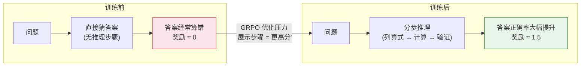
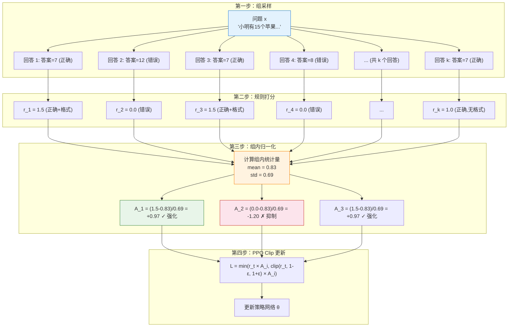

# 7.4 动手：GRPO 训练与核心机制

上一章我们深入了 DPO 的理论与实践，看到它通过数学变换绕过了 RM。但 DPO 是 offline 方法——它只能从固定的偏好数据集中学习，不能在线探索。这一节我们换一个思路：**用 GRPO 在线训练一个模型做数学推理**，亲眼看看"干掉 Critic"之后训练过程是什么样的，然后深入理解为什么组内归一化能替代 Critic。

## 7.4.1 GRPO 训练实验

### 实验设置：GSM8K + 规则奖励

GSM8K 是一个包含 8500 道小学数学应用题的数据集，每道题都有明确的数值答案。这恰好是一个有"客观正确答案"的场景——不需要 RM，直接用规则判断答案是否正确：

- 答案正确：$+1.0$ 分
- 格式规范（有清晰的推理步骤）：$+0.5$ 分
- 答案错误：$0$ 分

```python
# 1. 规则奖励函数（不需要 RM！）
import re

def rule_based_reward(prompt: str, response: str, ground_truth: str) -> float:
    reward = 0.0
    # 格式分：检查 \boxed{...}
    if re.search(r'\\boxed\{[^}]+\}', response):
        reward += 0.5
    # 答案分：提取最终答案并比较
    answer_match = re.search(r'\\boxed\{([^}]+)\}', response)
    if answer_match:
        model_answer = answer_match.group(1).strip()
        try:
            if abs(float(model_answer) - float(ground_truth)) < 0.01:
                reward += 1.0
        except ValueError:
            if model_answer == ground_truth:
                reward += 1.0
    return reward

# 测试
prompt = "Janet 的鸡蛋盒子每天能装 16 个鸡蛋。她每天早上吃 3 个，下午用 4 个烤松饼。她每周能卖多少个鸡蛋？"
good = "首先计算每天剩余的鸡蛋数：16 - 3 - 4 = 9 个\n每周有 7 天，所以每周能卖：9 × 7 = 63 个\n\\boxed{63}"
bad = "我觉得大概能卖 50 个左右吧。\\boxed{50}"
print(rule_based_reward(prompt, good, '63'))  # 1.5
print(rule_based_reward(prompt, bad, '63'))   # 0.5
```

注意这里的关键区别：**不需要训练任何 RM，规则就是裁判**。数学题有标准答案，直接比较就行。这种"可验证奖励"正是 RLVR 的核心思想（8.3 节会深入讨论）。

### 运行 GRPO 训练

我们使用 `trl` 库提供的 GRPO 实现。和 PPO 相比，GRPO 不需要 Critic 模型：

```python
# 2. GRPO 训练代码（简化示意）
from trl import GRPOTrainer, GRPOConfig
from transformers import AutoModelForCausalLM, AutoTokenizer
from datasets import load_dataset

model = AutoModelForCausalLM.from_pretrained("Qwen/Qwen2.5-1.5B-Instruct")
tokenizer = AutoTokenizer.from_pretrained("Qwen/Qwen2.5-1.5B-Instruct")

config = GRPOConfig(
    output_dir="./grpo_gsm8k",
    num_generations=8,        # 每个问题生成 k=8 个回答（组大小）
    per_device_train_batch_size=4,
    learning_rate=5e-6,
    num_train_epochs=1,
    # 不需要 Critic！这是 GRPO 的核心创新
)

gsm8k = load_dataset("openai/gsm8k", "main")
trainer = GRPOTrainer(
    model=model,
    args=config,
    train_dataset=gsm8k["train"],
    reward_funcs=[rule_based_reward],  # 直接传入规则奖励函数
    tokenizer=tokenizer,
)

trainer.train()  # 开始训练——不需要 Critic，不需要 RM
trainer.save_model("./grpo_gsm8k/final_model")
```

### 训练前后：推理步骤的变化

GRPO 训练最令人兴奋的观察是模型推理方式的变化：

**训练前**（直接猜答案）：

```
题目：小明有 15 个苹果，给了小红 3 个，又给了小刚 5 个，还剩多少个？
回答：我觉得还剩 7 个。\boxed{7}
```

**训练后**（展示推理过程）：

```
题目：小明有 15 个苹果，给了小红 3 个，又给了小刚 5 个，还剩多少个？
回答：
让我一步一步算：
- 小明一开始有 15 个苹果
- 给了小红 3 个：15 - 3 = 12
- 又给了小刚 5 个：12 - 5 = 7
- 所以还剩 7 个
\boxed{7}
```

模型从"直接猜答案"变成了"先列算式再计算"——这不是我们教它的，而是模型在 GRPO 训练过程中自己"领悟"出来的。因为展示推理步骤能提高答案正确率（拿到更高的规则奖励），所以 GRPO 的优化压力自然地选择了这条路径。



## 7.4.2 组内归一化：为什么能替代 Critic

上面我们看到了"省掉 Critic"的实际效果——显存减少 30-40%，推理步骤从"猜答案"变成"列算式"。但一个核心问题还没有回答：**组内归一化为什么能替代 Critic 的工作？**

### PPO Critic 的三大问题

在回答"为什么能替代"之前，先说清楚"为什么要替代"。PPO 的 Critic 在 LLM 训练中面临三个严重问题：

**1. 吃显存**：Critic 与 Actor 同等规模，PPO 需要同时装下 Actor + Critic + Reference + RM 四个模型。

**2. 训练不稳定**：价值函数 $V(s)$ 需要从"部分生成的文本"预测"最终得分"，但 LLM 序列很长（500+ tokens），监督信号只在末尾才有，方差极大。

**3. 工程复杂**：四个模型各有一套优化器、学习率、梯度裁剪配置，调参难度指数级增长。

回顾第 5 章，Critic 的核心作用是**提供基线来降低方差**。如果不需要单独训练网络就能得到基线，Critic 就可以退休了。

### GRPO 的核心思路

GRPO 的想法出奇地简单。对于每个问题 $x$，采样 $k$ 个回答 $\{y_1, y_2, \ldots, y_k\}$，用奖励函数给每个回答打分 $\{r_1, r_2, \ldots, r_k\}$，然后做**组内归一化**：

$$A_i = \frac{r_i - \text{mean}(r_1, \ldots, r_k)}{\text{std}(r_1, \ldots, r_k)}$$

这个公式做的事情和 Critic 一模一样——**减去均值就是"比平均好了多少"**。只不过 Critic 用一个单独的神经网络来预测"均值"（$V(s)$），而 GRPO 直接用同一组回答的实际得分均值。



组内归一化有效的原因有三个：

**难度归一化**：不同题目的难度不同。简单题所有回答都正确（奖励均值很高），难题大部分回答都错误（奖励均值很低）。如果用绝对奖励，简单题的回答会获得更高的梯度信号，模型会把大部分精力花在简单题上。组内归一化消除了这种偏差——它只关注"这道题内部谁更好"，不受题目绝对难度的影响。

**相对比较更稳定**：人类偏好本质上也是比较式的（"A 比 B 好"），不是绝对的（"A 得 87 分"）。GRPO 的组内比较和人类的判断方式天然一致。

**方差更低**：同一组内的回答共享相同的 prompt，唯一的差异是模型生成的随机性。这种"控制变量"式的比较比跨样本的绝对评分更稳定。

一句话总结：**GRPO = PPO 的裁剪机制 + 用组内排名替代 Critic**。

## 7.4.3 实验对比与参数调优

### 显存占用对比

| 模型大小 | PPO 显存（4 模型） | GRPO 显存（2 模型） | 节省比例 |
| -------- | ------------------ | ------------------- | -------- |
| 1.5B     | ~24 GB             | ~14 GB              | ~42%     |
| 7B       | ~80 GB             | ~48 GB              | ~40%     |
| 14B      | ~160 GB            | ~96 GB              | ~40%     |
| 70B      | ~640 GB            | ~384 GB             | ~40%     |

GRPO 省掉了 Critic（和 Actor 同等规模）和 RM 两个模型，通常能减少 30-40% 的显存占用。在实际工程中，这意味着原本需要 8 张 A100 的训练任务，现在 5 张就够了。

### 组内方差的演化

GRPO 的核心创新是用组内归一化替代 Critic。在训练初期，同一个问题的 8 个回答质量差异很大（方差高）。随着训练推进，组内回答质量趋于一致（方差降低），大部分回答都能答对。

```
训练初期（Episode 10）：
  问题 "15 - 3 - 5 = ?" 的 8 个回答：[3, 7, 12, 7, 15, 7, 8, 10]
  组内方差：高（答案五花八门）
  归一化优势：[−1.2, +0.1, +0.8, +0.1, +1.5, +0.1, −0.3, +0.6]

训练中期（Episode 100）：
  同一问题的 8 个回答：[7, 7, 7, 8, 7, 7, 7, 7]
  组内方差：低（大部分答对了）
  归一化优势：[0, 0, 0, −0.5, 0, 0, 0, 0]

训练后期（Episode 300）：
  同一问题的 8 个回答：[7, 7, 7, 7, 7, 7, 7, 7]
  组内方差：接近零（全部答对）
  归一化优势：全部接近零 → 无梯度信号
```

当组内方差降为零时，优势全部为零，没有梯度信号了——模型在这个问题上"毕业"了。这正是我们想要的行为：训练信号自然地转移到还没掌握的题目上。

### k 值的选择

k（组大小）是 GRPO 最关键的超参数，它直接影响组内归一化的质量：

| k 值 | 采样成本                | 归一化质量               | 适用场景     |
| ---- | ----------------------- | ------------------------ | ------------ |
| 2    | 低（每个问题只采 2 次） | 差（均值和标准差不稳定） | 快速验证     |
| 4    | 中等                    | 一般                     | 资源有限时   |
| 8    | 较高                    | 良好                     | **默认推荐** |
| 16   | 高                      | 很好（统计量更稳定）     | 追求上限     |
| 64   | 很高                    | 极好                     | 大规模训练   |

```python
# GRPO 组内归一化的简单实现
import numpy as np

def grpo_group_normalize(rewards: list[float]) -> list[float]:
    rewards = np.array(rewards, dtype=float)
    mean, std = rewards.mean(), rewards.std()
    if std < 1e-8:
        return np.zeros_like(rewards)
    return (rewards - mean) / std

# 示例：8 个回答的奖励
rewards = [1.5, 0.0, 1.5, 0.0, 1.0, 1.5, 0.5, 1.5]
advantages = grpo_group_normalize(rewards)
# 归一化优势: [ 0.82 -1.23  0.82 -1.23  0.12  0.82 -0.53  0.82]
# 均值: 0.875, 标准差: 0.637
```

<details>
<summary>思考题：GRPO 的组内归一化在什么情况下会失效？</summary>

1. **k 太小**：$k=2$ 时均值和标准差极不稳定，统计量不可靠。
2. **奖励分布偏斜**：大部分回答得零分时，少数高分回答主导梯度信号。
3. **所有回答质量相同**：方差为零，优势全部为零，无梯度信号——即训练后期"毕业"现象。
4. **奖励信号不连续**：只有 0/1 两个值时，归一化后的优势分布是离散的，梯度信号不够精细。

GRPO 通过 DAPO 的"动态采样"改进来缓解这些问题——过滤掉模型已经答对的题目，只保留有梯度信号的样本。

</details>

### GRPO 与 PPO 全面对比

| 组件           | PPO                               | GRPO                               |
| -------------- | --------------------------------- | ---------------------------------- |
| 基线（Critic） | 独立的 $V(s)$ 网络                | 组内均值 $\bar{r}$                 |
| 优势计算       | $A = R - V(s)$ 或 GAE             | $A_i = (r_i - \bar{r}) / \sigma_r$ |
| 模型数量       | 4 个（Actor + Critic + Ref + RM） | 2 个（Actor + Ref）                |
| 裁剪机制       | PPO Clip                          | 同样的 PPO Clip                    |
| 采样方式       | 在线交互                          | 组采样（每个 prompt 采 k 个）      |
| 显存           | 高                                | 低 30-40%                          |
| 基线质量       | 依赖 Critic 训练质量              | 依赖组大小 $k$                     |
| 基线更新速度   | 需要重新训练 Critic               | 自动随 batch 更新                  |

值得注意的是，GRPO 继承了 PPO 的裁剪机制，但没有继承 GAE。原因是 GRPO 的奖励通常只在序列末尾给出一个信号（答对/答错），而不是每个 token 都有奖励。在这种情况下，GAE 的多步 TD 退化为单步，和直接用最终奖励减去均值没有本质区别。

GRPO 通过组内归一化优雅地解决了 Critic 的问题。但这只是第一步——在奖励端，还有更大的革新正在发生。DeepSeek-R1-Zero 证明了不需要 SFT 也能做纯 RL 训练，RLVR 用可验证奖励取代了人工标注。让我们看看这些前沿进展——[DeepSeek-R1-Zero、DAPO 与 RLVR](./deepseek-dapo-rlvr)。
