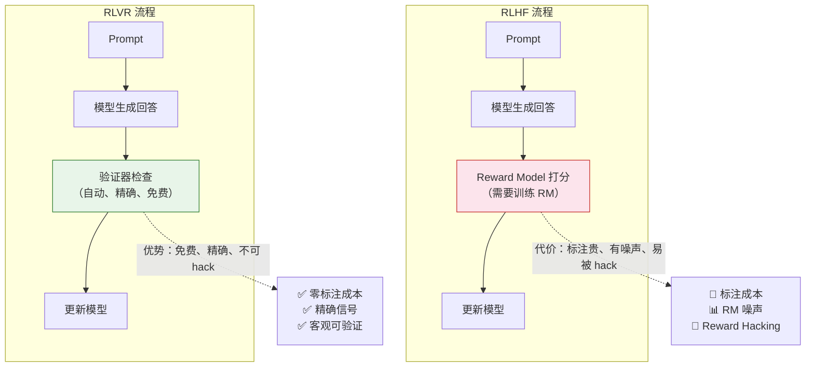

# 9.5 RLVR：可验证奖励强化学习

上一节我们看到 DeepSeek-R1-Zero 和 DAPO 在策略端的突破——纯 RL 不需要 SFT，GRPO 可以更高效。但它们都有一个隐含前提：**奖励信号是可靠的**。在数学和代码领域，这个前提自然成立（答对就是答对）。RLVR（Reinforcement Learning with Verifiable Rewards）把这件事正式化成了一个范式：**在那些有客观答案的领域，不需要训练 RM，直接用规则验证就行**。

### RLHF vs RLVR 对比

| 方面             | RLHF                       | RLVR                         |
| ---------------- | -------------------------- | ---------------------------- |
| **数据成本**     | 极高（需要人工标注偏好对） | 极低（自动验证）             |
| **奖励质量**     | 有噪声（人类主观性）       | 精确（客观对错）             |
| **可扩展性**     | 受标注速度限制             | 几乎无限                     |
| **适用范围**     | 主观偏好（礼貌、安全）     | 客观任务（数学、代码、逻辑） |
| **训练稳定性**   | 受 RM 质量影响             | 非常稳定（奖励信号清晰）     |
| **被 Hack 风险** | 高（模型学会钻 RM 的空子） | 低（规则是硬性的）           |

### RLVR 的验证器设计

不同领域有不同的验证方式：

| 领域       | 验证方式   | 示例                        |
| ---------- | ---------- | --------------------------- |
| 数学       | 答案匹配   | `\boxed{42}` == 标准答案    |
| 代码       | 单元测试   | 代码执行 + test case 通过率 |
| 逻辑推理   | 形式化验证 | Lean/Coq 定理证明器         |
| 多语言翻译 | 自动评分   | BLEU/COMET 分数             |

验证器的设计是 RLVR 的关键。好的验证器需要满足三个条件：**确定性**（同样的输入永远得到同样的结果）、**正确性**（验证器的判断确实反映了回答的质量）、**高效性**（验证速度要快，不能成为训练瓶颈）。

其中"正确性"是最微妙的要求。以数学题的答案匹配为例：如果标准答案是 $\frac{22}{7}$，模型回答了 $3.1428...$，算不算正确？如果标准答案是 $(x+1)(x-2)$，模型回答了 $x^2 - x - 2$，算不算正确？这些边界情况需要验证器仔细处理。实践中，数学验证器通常会做数值比较（容差范围内算正确）和表达式化简（展开/因式分解后比较），以处理这些等价表示的情况。

### RLVR 的局限与争议

RLVR 不是万能的，它有几个重要的局限：

1. **只适用于有客观答案的领域**：数学、代码、逻辑推理这些领域有明确的对错标准。但"更礼貌""更有创意""更安全"这类主观偏好，RLVR 没有办法给出精确的奖励信号。在这些领域，仍然需要 RM 或偏好数据。

2. **验证器可能被 hack**：即使奖励是规则生成的，模型仍然可能找到"满足规则但不真正理解"的捷径。比如在数学题中，模型可能学会了一种"特殊技巧"能通过特定类型的验证，但换个问法就答不对了。

3. **"RLVR 真的提升推理能力吗？"**：这是 2025 年 NeurIPS 的一篇 oral 论文提出的尖锐问题。他们质疑 RLVR 可能只是在提高搜索效率（让模型在推理时更高效地找到正确答案），而非真正注入新的推理能力。这是一个开放的前沿争议。

### 1-Shot RLVR

更令人惊讶的是，ICLR 2025 的研究表明 RLVR **只用 1 个训练样本**就能工作。研究者发现，即使训练集中只有一个数学题，RL 训练仍然能让模型在大量未见过的题目上表现更好。

这说明 RLVR 的有效性不依赖于数据量——模型在预训练阶段已经学到了推理能力，RLVR 的作用是"解锁"这些潜在能力，而不是从零教起。这就像一个学生已经理解了数学概念，但从来没被要求做过题——RL 训练就是"考试"的压力，迫使他把自己已有的知识组织成可用的解题策略。

这个发现对实践有重要指导意义。它意味着 RLVR 训练的"性价比"非常高——你不需要海量数据就能获得显著提升。关键不在于数据的数量，而在于训练过程的设置（奖励函数设计、组大小、训练步数等）。这也解释了为什么 DeepSeek-R1-Zero 能够成功——即使没有任何 SFT 数据，只要 RL 训练设置正确，模型就能自己"进化"出推理能力。

思考题：如果 RLVR 只需要 1 个样本就能工作，那为什么实际训练中仍然需要大量数据？

1 个样本能"启动"训练过程，但要让模型在多样化的场景下都表现好，仍然需要不同类型、不同难度的训练数据。原因包括：

- **泛化性**：只用 1 个样本训练，模型可能只在那道题的"邻域"内表现好。要覆盖广泛的题目类型，需要多样化的数据。
- **避免过拟合**：如果训练数据太少，模型可能只记住了那道题的特定解法，而不是学会了通用的推理策略。
- **统计稳定性**：1 个样本的成功有偶然性。大量数据的统计平均能确保训练方向是正确的。

1-Shot RLVR 的真正意义是理论上的——它证明了 RL 的价值不在于"注入新知识"，而在于"激活已有能力"。这改变了我们对 RL 在 LLM 训练中角色的理解。

GRPO 在策略端省掉了 Critic，RLVR 在奖励端省掉了 RM。这两者结合，把 RL 训练的复杂度压缩到了极致。但 RL 的故事并没有结束——更激动人心的方向是 RL Scaling 和 Test-time Scaling。让我们在[第 12 章](../chapter12_future_trends/rl-scaling-outlook)看看这些前沿方向——RL Scaling 与未来展望。
