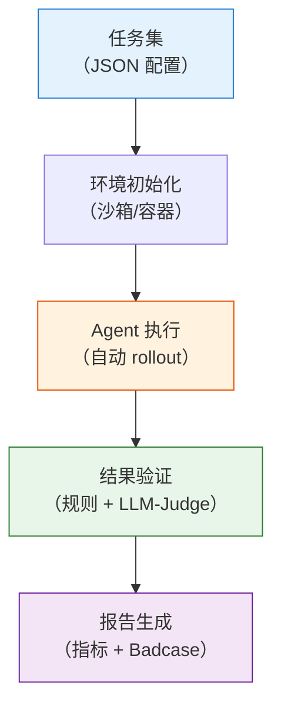

# Agentic 评测体系与 Benchmark 全景

> Agentic RL 的评估远比标准 LLM 评估复杂——不只是"回答对不对"，而是"在一个复杂的多步任务中，Agent 是否选择了正确的工具、走了正确的路径、高效地完成了任务"。评测也不是训练后的事后补救，而是贯穿训练全过程的反馈回路。本节系统梳理 Agentic 领域的评估基准和评测工程。

## 核心评估维度

Agentic RL 的评估可以从三个维度来理解：

| 维度     | 评估什么                  | 代表性基准                   |
| -------- | ------------------------- | ---------------------------- |
| 工具调用 | 模型能否正确调用 API/工具 | BFCL、ACEBench、API-Bank     |
| 任务完成 | Agent 能否完成端到端任务  | SWE-bench、WebArena、τ-bench |
| 综合能力 | 通用智能助手水平          | GAIA、Toolathlon             |

下面按维度逐一介绍主流 benchmark。

## 工具调用排行榜

**BFCL（Berkeley Function Calling Leaderboard）** 是目前业界最权威的工具调用排行榜，由 UC Berkeley 的 Gorilla 团队维护。它评估模型在各种场景下正确调用函数的能力——简单函数、多函数组合、RESTful API、 Java 函数等。BFCL v3 包含 2,000+ 测试用例，覆盖从单工具到多工具、从简单参数到嵌套对象的各类场景。排行榜地址：[gorilla.cs.berkeley.edu/leaderboard.html](https://gorilla.cs.berkeley.edu/leaderboard.html)。

**ACEBench** 从更细的粒度评估工具使用能力，将评测分为 Normal（基础调用）、Special（高级场景如并行调用、长上下文）和 Agent（多智能体协作）三个类别。ACEBench 被 ACL 2025 收录，是目前最全面的工具使用评测之一。

**API-Bank** 提供了 53 个常用 API 工具和 314 个工具使用对话，侧重评估 API 规划、检索和调用的完整能力链。

## 端到端任务基准

**SWE-bench** 评估的是代码智能体解决真实 GitHub Issue 的能力——给定一个开源项目的 Issue 描述，Agent 需要理解代码库、定位问题、编写修复补丁。这是目前最难的代码 Agent 评测之一，顶级模型（如 Claude Opus）的解决率也仅在 50% 左右。排行榜地址：[swebench.com](https://www.swebench.com/)。

**WebArena** 提供了一个真实的 Web 环境让 Agent 执行任务——在电商网站购物、在论坛发帖、在 GitLab 上管理代码仓库。Agent 需要理解网页的视觉布局和 DOM 结构，执行点击、输入、导航等操作。这比 BFCL 的"调用一个函数"要难得多——Agent 需要在真实、动态的 Web 环境中行动。

**τ-bench（tau-bench）** 评估对话式智能体与用户协作完成领域任务的能力。它模拟了航空订票、电商客服等真实场景，Agent 需要引导用户提供信息、查询数据库、执行操作。核心挑战是 Agent 需要在多轮对话中维护状态、处理用户的不确定输入。

## 综合能力基准

**GAIA（General AI Assistants Benchmark）** 是目前最具挑战性的通用 AI 助手评测之一，包含 450 个需要推理、多模态理解、工具使用、Web 搜索等多种能力的问题。GAIA 分为三个难度等级，即使是顶级模型在最高难度上的表现也远未饱和。排行榜地址：[HuggingFace GAIA Leaderboard](https://huggingface.co/spaces/gaia-benchmark/leaderboard)。

**Toolathlon** 专注于多工具、长时间工作流的评测，包含 108 个手选的复杂任务，每个任务平均需要与 20+ 个工具交互。它评估的不只是"能不能用工具"，而是"能不能编排复杂的工作流"。

## 特定场景的评测

除了上面三大维度的通用 benchmark，Agentic RL 还有两个重要的垂直评测场景。

### Deep Research Agent 的评估

Deep Research Agent 的"好"远不止最终答案的正确性，需要同时满足四个层次：

| 层次       | 含义                 | 评估方式                         |
| ---------- | -------------------- | -------------------------------- |
| 答案正确性 | 最终结论是否正确     | 与标准答案对比（Exact Match/F1） |
| 引用可靠性 | 每个论断是否有据可查 | 引用 URL 可访问性 + 内容相关性   |
| 过程严谨性 | 推理链条是否逻辑自洽 | 步骤级 PRM 评分                  |
| 执行效率   | 是否以最少的步骤完成 | 完成任务所需的交互轮数           |

主流评估基准包括：

- **GAIA**：真实世界复杂问答，需多步推理与工具使用，SOTA 模型约 50-60%
- **Humanity's Last Exam (HLE)**：多学科专家级难题，SFR-DeepResearch 达 28.7%
- **WebArena / Mind2Web**：网页环境中的操作成功率
- **BFCL**：工具/API 调用的精确性

更多细节见 [12.5 节 Deep Research Agent](./deep-research-agent) 的评估体系部分。

## 怎么选基准？

```
你要评估什么？                    推荐基准
├─ 基础函数调用能力               → BFCL
├─ 多场景工具使用                 → ACEBench
├─ 代码修复能力                   → SWE-bench
├─ Web 操作能力                   → WebArena
├─ 多轮对话协作                   → τ-bench
└─ 综合智能助手水平               → GAIA / Toolathlon
```

一个务实的建议：**从 BFCL 开始**。它最容易上手，评测成本最低（不需要沙箱环境），可以快速验证你的 Agent 的基础工具调用能力。等基础能力达标后，再用 SWE-bench 或 WebArena 评估端到端的任务完成能力。

## Agent 评测系统设计

上面列出了"用什么基准评测"。但工业界面临的更实际的问题是：**怎么搭一个评测系统**？特别是当你的 Agent 在快速迭代时，你需要一个自动化、可复现、能回归检测的评测平台。

### 评测 Pipeline 架构

一个完整的 Agent 评测 Pipeline 包含五个环节：



```python
# ==========================================
# Agent 评测 Pipeline（简化版）
# ==========================================

class AgentEvaluationPipeline:
    """Agent 评测流水线"""

    def __init__(self, sandbox, judge_model):
        self.sandbox = sandbox      # Docker 沙箱
        self.judge = judge_model    # LLM-as-Judge

    def run_evaluation(self, agent, task_set):
        """运行完整评测"""
        results = []

        for task in task_set:
            # 1. 初始化环境（每个任务独立的沙箱）
            env = self.sandbox.create_isolated_env(task.get("setup", {}))

            # 2. Agent 执行任务
            trajectory = agent.run(task["prompt"], env, max_turns=task.get("max_turns", 20))

            # 3. 结果验证
            if task.get("verify_type") == "exact_match":
                passed = trajectory.final_answer.strip() == task["expected_answer"].strip()
            elif task.get("verify_type") == "execution":
                # 代码类任务：在沙箱中执行验证脚本
                passed = env.execute(task["verify_script"], trajectory.final_answer)
            elif task.get("verify_type") == "llm_judge":
                # 主观类任务：用 LLM 评估
                passed = self.judge.evaluate(task["prompt"], trajectory.final_answer, task["rubric"])
            else:
                passed = False

            results.append({
                "task_id": task["id"],
                "passed": passed,
                "turns": trajectory.num_turns,
                "tool_calls": trajectory.tool_calls,
                "final_answer": trajectory.final_answer
            })

        return results

    def regression_test(self, agent, baseline_results, task_set):
        """回归测试：新模型不能退步旧能力"""
        new_results = self.run_evaluation(agent, task_set)

        regressions = []
        for old, new in zip(baseline_results, new_results):
            if old["passed"] and not new["passed"]:
                regressions.append({
                    "task_id": old["task_id"],
                    "old_answer": old["final_answer"],
                    "new_answer": new["final_answer"]
                })

        if regressions:
            print(f"⚠️ 发现 {len(regressions)} 处能力退化！")
        return regressions
```

### 自动化复测框架

**确定性任务**（代码执行、API 调用、数学计算）可以直接用规则验证——答案对不对、代码能不能跑、API 调用参数对不对。这些评测是完全自动化的，不需要人工介入。

**非确定性任务**（开放式问答、创意生成、多轮对话）需要用 LLM-as-Judge 评估。关键是设计好评分标准（Rubric），让 Judge 的评估可复现：

```python
RUBRIC_TEMPLATE = """
评估标准（每项 1-5 分）：

1. 准确性：回答中的事实是否正确？是否有幻觉？
2. 完整性：是否完整回答了用户的问题？有无遗漏？
3. 引用质量：如果有引用，是否真实可访问？是否支持论断？
4. 效率：是否用了合理的步骤数完成任务？有无冗余操作？

总分 = 各项加权平均
"""
```

### 评测驱动训练改进

评测不只是"打分"，更重要的是**把评测结果反馈到训练循环**中。完整的闭环是：

```
评测 → Badcase 分析 → 定向数据合成 → 再训练 → 再评测
```

具体来说：

1. **收集失败案例**：评测中未通过的任务
2. **归因分析**：是工具调用错了？还是推理逻辑错了？还是信息不够？
3. **定向合成**：针对失败类型生成训练数据（参考[12.2 节轨迹合成](./trajectory-synthesis)）
4. **训练改进**：用新数据做一轮 GRPO/PPO 训练
5. **回归验证**：确保新模型在修复问题的同时没有退步旧能力

这个闭环和[附录 B 的评测体系](/appendix_industrial_training/evaluation-badcase)是一脉相承的，只是从 LLM 评测扩展到了 Agent 评测。Agent 评测的特殊之处在于需要管理沙箱环境和工具执行状态，这使得 Pipeline 的实现复杂度更高。

## 参考资料

- Patil S, et al. "[The Berkeley Function Calling Leaderboard](https://gorilla.cs.berkeley.edu/leaderboard.html)." 2023. —— BFCL 排行榜，评估 LLM 函数调用能力。
- Jimenez C E, et al. "[SWE-bench: Can Language Models Resolve Real-World GitHub Issues?](https://arxiv.org/abs/2310.06770)." ICLR 2024. —— 代码智能体评估基准。
- Zhou S, et al. "[WebArena: A Realistic Web Environment for Building Autonomous Agents](https://arxiv.org/abs/2307.13854)." ICLR 2024. —— Web Agent 评估环境。
- Mialon G, Fourrier C, Wolf T, et al. "[GAIA: A Benchmark for General AI Assistants](https://arxiv.org/abs/2311.12983)." NeurIPS 2023. —— 通用 AI 助手评测。
- Ma L, et al. "[ACEBench: Who Wins the Match Point in Tool Usage?](https://arxiv.org/abs/2501.12851)." ACL 2025. —— 综合工具使用评测。
- Sierra Team. "[τ-bench: A Benchmark for Tool-Agent-User Interaction in Real-World Domains](https://arxiv.org/abs/2406.12045)." arXiv:2406.12045, 2024. —— 对话式智能体评测。
- Li M, et al. "[API-Bank: A Comprehensive Benchmark for Tool-Augmented LLMs](https://arxiv.org/abs/2304.08244)." EMNLP 2023. —— 工具增强 LLM 评测。
- Ji H, et al. "[The Tool Decathlon](https://arxiv.org/abs/2510.25726)." arXiv:2510.25726, 2024. —— Toolathlon，多工具长时间工作流评测。
