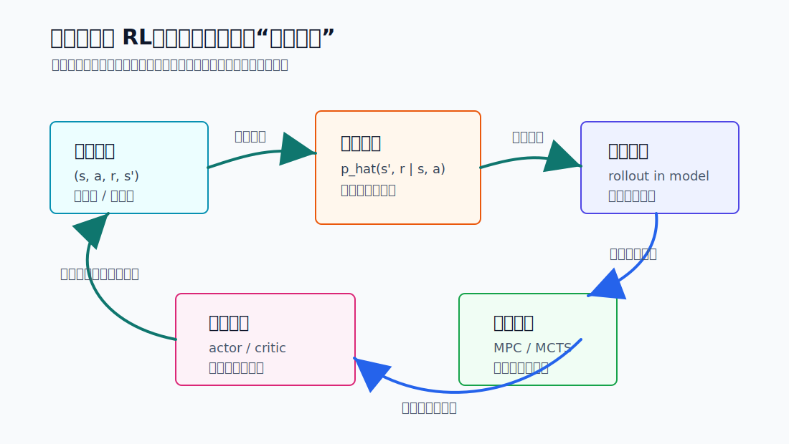
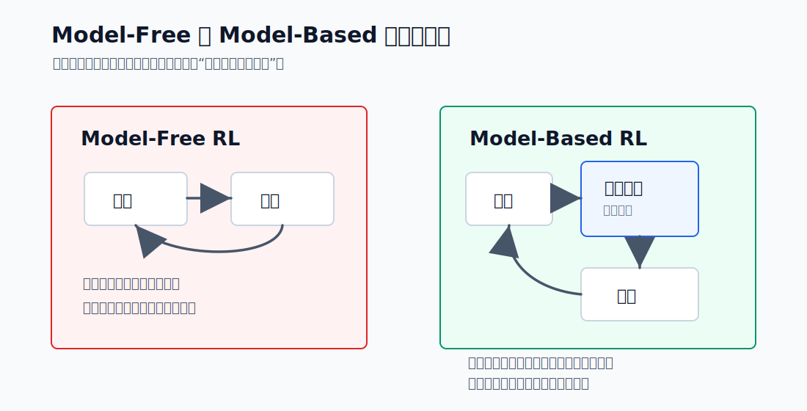
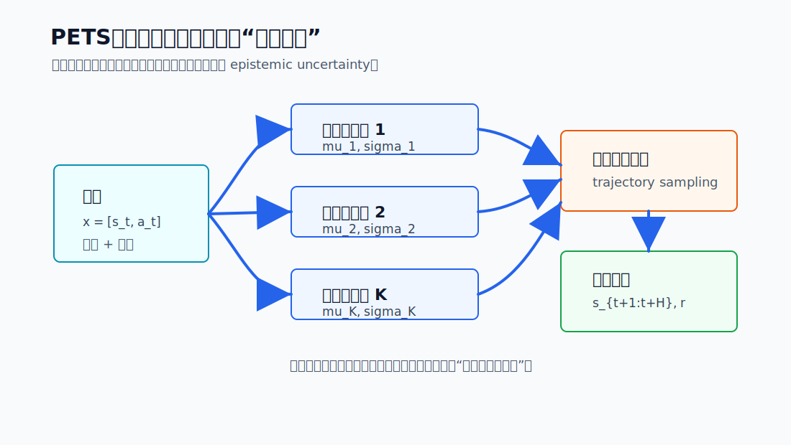
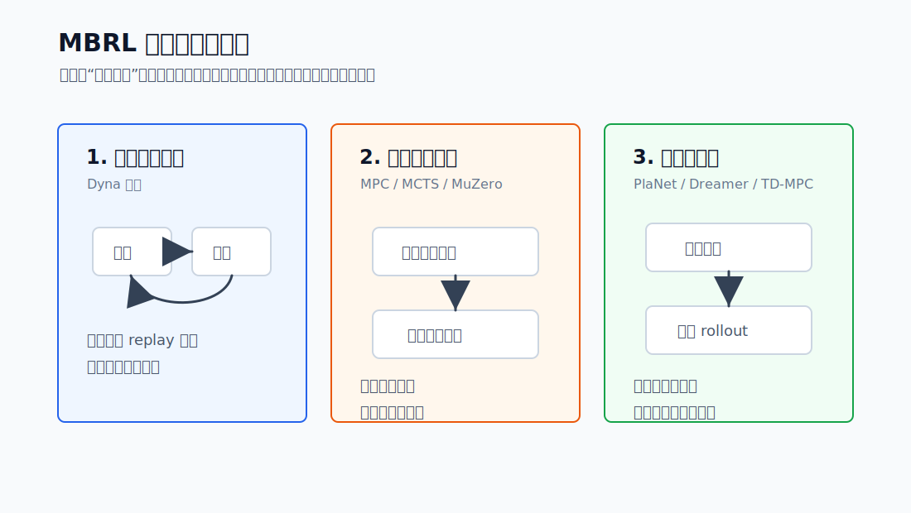
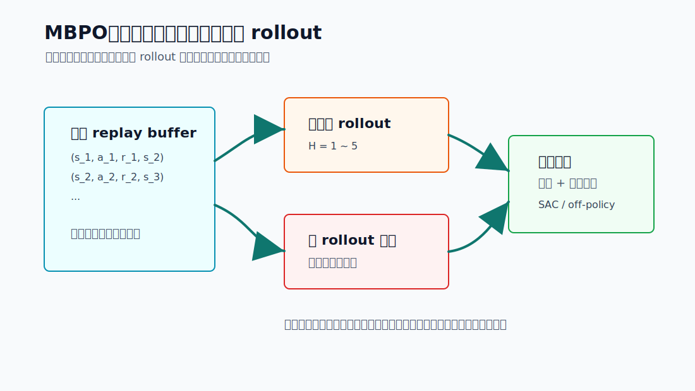
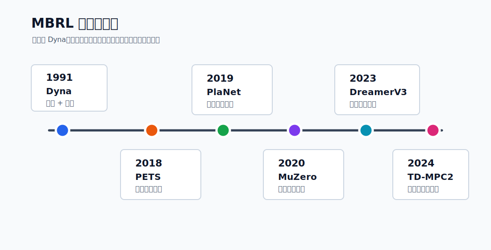
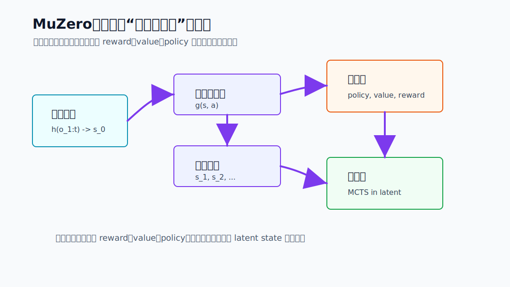
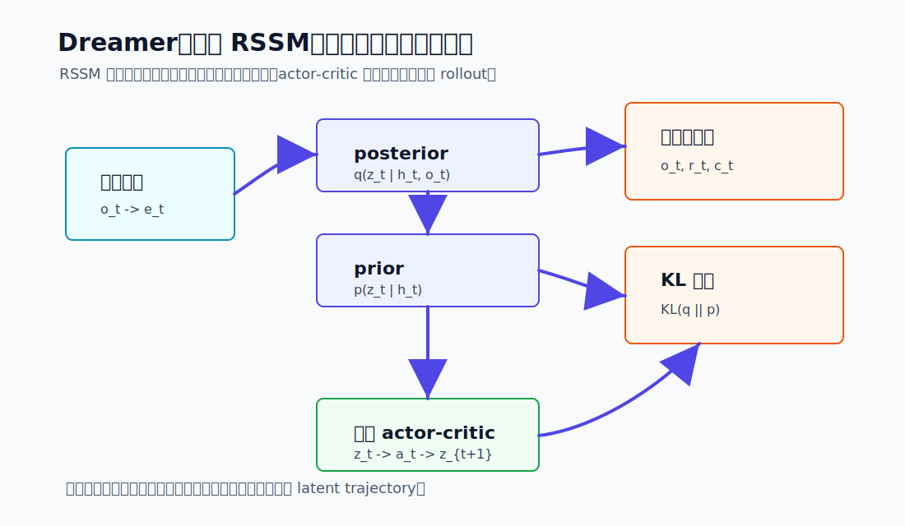
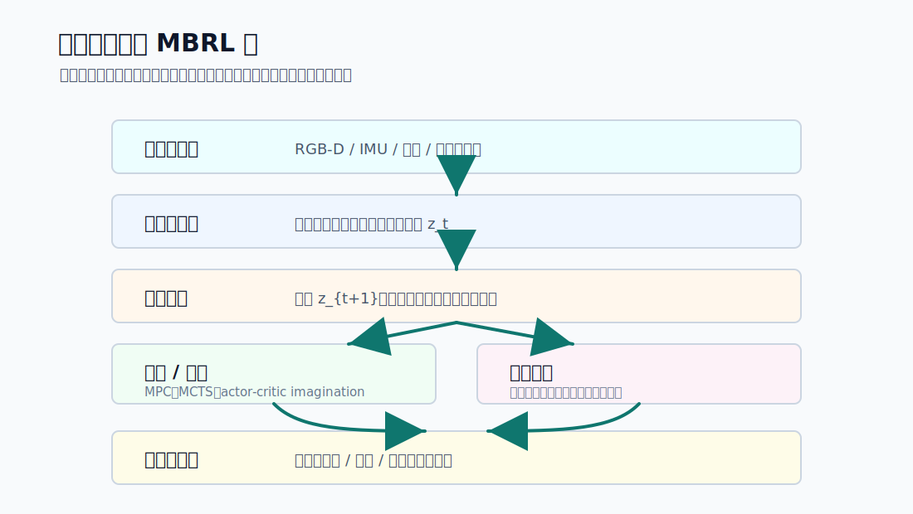
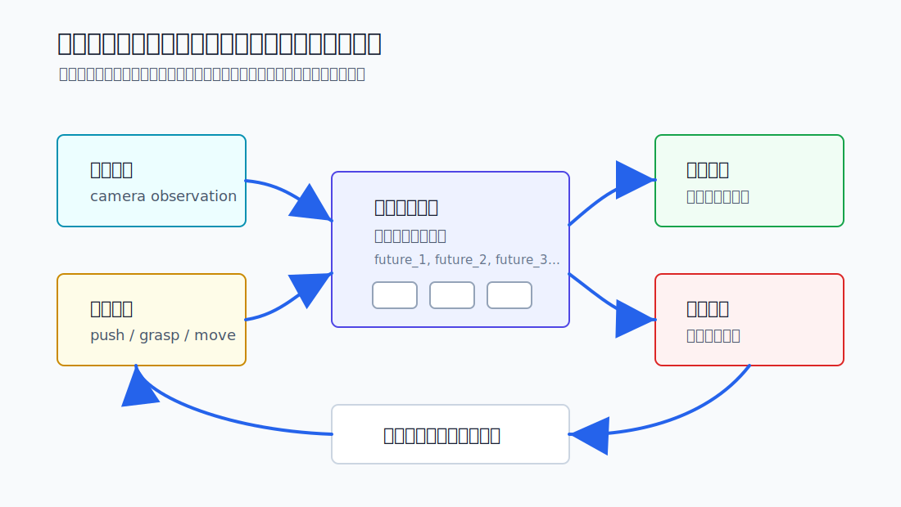

# 12.1.1 基于模型的 RL：从 Model-Free 到 Model-Based

在具身智能中，真实世界不是一个可以无限 `reset()` 的 Gym 环境。机械臂夹错一次可能会撞到桌面，四足机器人摔一次可能要人工扶起，自动驾驶更不可能靠真实事故来探索边界条件。因此，具身 RL 最核心的问题之一是：**能不能少在真实世界试错，多在“脑内世界”里推演？**

这就是 **Model-Based RL（MBRL，基于模型的强化学习）** 的出发点。它让智能体先学习一个环境模型，再用这个模型做规划、生成想象轨迹，或者辅助策略更新。相比 Model-Free 方法，MBRL 的目标不是只学“这个状态下该做什么”，而是进一步学“我这么做以后，世界会怎样变化”。



<div style="text-align: center; font-size: 0.9em; color: var(--vp-c-text-2); margin-top: -10px; margin-bottom: 20px;">
  <em>图 1：MBRL 的闭环结构。真实交互用来校准世界模型，世界模型再支持想象轨迹、规划搜索与策略更新。</em>
</div>

## 从综述看：世界模型不止一种

近两年的综述文章提醒我们，“世界模型”已经不是一个只属于强化学习的小概念。Ding 等人在综述中把世界模型概括成两类核心功能：一类是 **understanding the world**，也就是构建内部表征来理解世界机制；另一类是 **predicting future dynamics**，也就是预测未来状态来支持仿真、规划和决策[^worldmodelsurvey]。本节讨论的 MBRL 主要落在第二类，但会频繁借用第一类的表征学习能力。

如果从具身智能角度看，世界模型还可以沿着三条轴来划分[^embodiedwmsurvey]：

| 划分维度     | 典型问题                            | 对 MBRL 的意义                         |
| ------------ | ----------------------------------- | -------------------------------------- |
| 功能         | 是为某个控制任务服务，还是通用仿真  | 决定模型要不要直接预测 reward/value    |
| 时间建模     | 一步步自回归 rollout，还是并行预测  | 决定是否容易出现长期误差累积           |
| 空间表征     | 低维状态、token、BEV/voxel、3D 表示 | 决定模型能否处理视觉、接触和几何约束   |
| 决策耦合程度 | 只生成未来，还是直接参与规划        | 决定它更像视频模型、仿真器，还是控制器 |

自动驾驶世界模型综述也给了一个更工程化的划分：世界模型可以用于生成未来物理世界、用于智能体行为规划，也可以把预测和规划放进同一个交互闭环[^adwmsurvey]。这和具身机器人非常接近：机器人既要“看见可能的未来”，也要“选择能安全到达的未来”。

因此，这篇文章会采用一个收敛的定义：**MBRL 里的世界模型，是一个能把当前状态、动作和历史压缩成可预测表征，并支持未来 rollout、规划搜索或策略训练的模型。** 它可以是低维动力学模型，可以是 Dreamer 那样的潜空间模型，可以是 MuZero 那种只服务于搜索的隐式模型，也可以和视频生成、JEPA 表征、自动驾驶占据预测这些更广义的世界模型互相借力。

## Model-Free vs Model-Based

到目前为止，本书大部分算法——从 DQN、PPO、SAC 到 DPO、GRPO——都属于 **Model-Free RL**。智能体不显式学习环境动力学，只通过真实或仿真交互来优化价值函数或策略。

MBRL 则多了一层“世界模型”：

$$
\hat{p}_\phi(s_{t+1}, r_t \mid s_t, a_t)
$$

这里的 $\hat{p}_\phi$ 是智能体学出来的环境近似模型。它可以预测下一状态、奖励、终止概率，或者在更现代的做法中，预测潜空间里的未来表征。

| 维度       | Model-Free RL                | Model-Based RL                         |
| ---------- | ---------------------------- | -------------------------------------- |
| 核心思路   | 直接学习策略或价值函数       | 先学习世界模型，再用模型规划或训练策略 |
| 样本效率   | 通常较低，需要大量交互       | 通常更高，可以复用模型生成想象经验     |
| 主要风险   | 试错成本高、探索慢           | 模型误差会被规划过程放大               |
| 代表算法   | DQN, PPO, SAC, DPO, GRPO     | Dyna, PETS, PlaNet, MuZero, Dreamer    |
| 适合场景   | 交互便宜、仿真充足、目标清晰 | 交互昂贵、需要预测未来、需要安全试错   |
| “脑内模拟” | 无显式模拟                   | 有，智能体可以在模型中推演未来         |

用一个直观类比：Model-Free 像一个只靠实战积累经验的棋手；Model-Based 像一个能在脑中推演几步棋的棋手。前者每一步都从真实反馈中学，后者会先想象几条可能路线，再决定怎么行动。



<div style="text-align: center; font-size: 0.9em; color: var(--vp-c-text-2); margin-top: -10px; margin-bottom: 20px;">
  <em>图 2：Model-Free 与 Model-Based 的差别。Model-Based RL 在策略与环境之间显式加入世界模型。</em>
</div>

## 从数学看：世界模型到底学什么？

最基础的 MBRL 会把真实交互收集成一个数据集：

$$
\mathcal{D}=\{(s_t, a_t, r_t, s_{t+1}, d_t)\}_{t=1}^{N}
$$

其中 $d_t$ 表示 episode 是否终止。世界模型要学习的是状态转移、奖励和终止概率：

$$
\hat{p}_\phi(s_{t+1}, r_t, d_t \mid s_t, a_t)
$$

如果状态维度较低，例如 MuJoCo 里的关节角、速度和接触信息，一个常见做法是预测状态差分：

$$
\Delta s_t=s_{t+1}-s_t,\qquad
\widehat{\Delta s_t}=f_\phi(s_t,a_t)
$$

确定性模型可以用均方误差训练：

$$
\mathcal{L}_{\text{det}}(\phi)
=\mathbb{E}_{\mathcal{D}}\left[
\|\Delta s_t-f_\phi(s_t,a_t)\|_2^2
+\lambda_r(r_t-\hat{r}_\phi(s_t,a_t))^2
\right]
$$

但机器人里的接触、摩擦、传感器噪声和遮挡往往不是确定的。PETS[^pets] 的关键贡献之一，是用 **概率动力学模型集成** 表达不确定性：

$$
p_{\phi_i}(\Delta s_t, r_t\mid s_t,a_t)
=\mathcal{N}(\mu_{\phi_i}(x_t), \Sigma_{\phi_i}(x_t)),
\qquad x_t=[s_t,a_t]
$$

训练目标通常写成高斯负对数似然：

$$
\mathcal{L}_{\text{nll}}(\phi_i)
=
\frac{1}{2}(y_t-\mu_{\phi_i})^\top\Sigma_{\phi_i}^{-1}(y_t-\mu_{\phi_i})
+\frac{1}{2}\log |\Sigma_{\phi_i}|,
\qquad y_t=[\Delta s_t,r_t]
$$



<div style="text-align: center; font-size: 0.9em; color: var(--vp-c-text-2); margin-top: -10px; margin-bottom: 20px;">
  <em>图 3：概率模型集成的 MBRL 训练流程。根据 PETS 的 probabilistic ensemble 与 trajectory sampling 机制改绘，来源：<a href="https://arxiv.org/abs/1805.12114">Chua et al., 2018</a>。</em>
</div>

这里有两个很重要的细节。

第一，模型输出方差 $\Sigma_{\phi_i}$ 可以描述 **aleatoric uncertainty**，也就是环境本身的随机性；不同模型成员之间的预测分歧可以描述 **epistemic uncertainty**，也就是数据不足导致的“不知道自己知不知道”。对具身机器人来说，第二种不确定性特别关键：如果几个模型对某个动作后果分歧很大，说明这片状态-动作空间还不可靠，规划时就应该保守。

第二，世界模型越往远处 rollout，误差越会累积。粗略地说，如果一步模型误差是 $\epsilon_{\text{model}}$，那么 $k$ 步预测误差会随 $k$ 增长：

$$
\epsilon_{t+k}\approx \mathcal{O}(k\epsilon_{\text{model}})
$$

这就是为什么很多成功的 MBRL 系统都不迷信长距离想象。PETS 用 MPC 每一步重新规划，MBPO[^mbpo] 只把模型用于短 rollout，Dreamer 则在压缩后的潜空间里想象未来，都是在降低 model bias 被放大的风险。

### 代码：训练一个概率动力学模型

下面是一个最小化版本的 PyTorch 动力学模型。实际系统还会做输入归一化、模型集成、early stopping、奖励头和终止头，这里先保留最核心的数学对应关系。

```python
import torch
import torch.nn as nn


class ProbabilisticDynamics(nn.Module):
    def __init__(self, state_dim: int, action_dim: int, hidden_dim: int = 256):
        super().__init__()
        out_dim = state_dim + 1  # delta_state + reward
        self.net = nn.Sequential(
            nn.Linear(state_dim + action_dim, hidden_dim),
            nn.SiLU(),
            nn.Linear(hidden_dim, hidden_dim),
            nn.SiLU(),
        )
        self.mu = nn.Linear(hidden_dim, out_dim)
        self.logvar = nn.Linear(hidden_dim, out_dim)

    def forward(self, state: torch.Tensor, action: torch.Tensor):
        h = self.net(torch.cat([state, action], dim=-1))
        mu = self.mu(h)
        logvar = self.logvar(h).clamp(-10.0, 2.0)
        return mu, logvar


def gaussian_nll(mu: torch.Tensor, logvar: torch.Tensor, target: torch.Tensor):
    inv_var = torch.exp(-logvar)
    return 0.5 * ((target - mu) ** 2 * inv_var + logvar).mean()


def train_step(model, optimizer, batch):
    state, action, reward, next_state = batch
    target = torch.cat([next_state - state, reward.unsqueeze(-1)], dim=-1)

    mu, logvar = model(state, action)
    loss = gaussian_nll(mu, logvar, target)

    optimizer.zero_grad()
    loss.backward()
    optimizer.step()
    return loss.item()
```

这段代码对应上面的 $\mathcal{L}_{\text{nll}}$：模型不只预测均值 $\mu$，还预测每个维度的不确定性 `logvar`。在规划时，可以从这个高斯分布采样多个未来，也可以把不确定性加入惩罚项，让机器人避开模型没有把握的动作。

### 代码：用 CEM 做 MPC 规划

有了模型以后，最直接的控制方式是 MPC：采样一批动作序列，用模型评估未来回报，留下精英序列更新分布，最后只执行第一步动作。下面的 CEM（Cross-Entropy Method）就是 PETS、MPC 类方法里常见的规划骨架。

```python
@torch.no_grad()
def rollout_model(model, state, actions, discount=0.99):
    # actions: [num_samples, horizon, action_dim]
    num_samples, horizon, _ = actions.shape
    state = state.expand(num_samples, -1)
    returns = torch.zeros(num_samples, device=state.device)
    gamma = 1.0

    for t in range(horizon):
        mu, logvar = model(state, actions[:, t])
        pred = mu + torch.randn_like(mu) * torch.exp(0.5 * logvar)
        delta_state, reward = pred[:, :-1], pred[:, -1]
        state = state + delta_state
        returns = returns + gamma * reward
        gamma *= discount

    return returns


@torch.no_grad()
def cem_plan(model, state, action_dim, horizon=15, iters=5, samples=512, elites=64):
    mean = torch.zeros(horizon, action_dim, device=state.device)
    std = torch.ones_like(mean)

    for _ in range(iters):
        actions = mean + std * torch.randn(samples, horizon, action_dim, device=state.device)
        actions = actions.clamp(-1.0, 1.0)
        scores = rollout_model(model, state, actions)
        elite_actions = actions[scores.topk(elites).indices]
        mean = elite_actions.mean(dim=0)
        std = elite_actions.std(dim=0).clamp_min(1e-3)

    return mean[0].clamp(-1.0, 1.0)
```

注意这个规划器每次只返回 `mean[0]`，也就是当前动作。执行完之后，智能体会拿到新的真实观测，再重新规划下一步。这种 receding horizon 的闭环，比一次性相信模型预测未来几十步稳得多。

## MBRL 的三种用法

MBRL 并不是单一算法，而是一组把“模型”放进 RL 闭环的范式。



<div style="text-align: center; font-size: 0.9em; color: var(--vp-c-text-2); margin-top: -10px; margin-bottom: 20px;">
  <em>图 4：世界模型的三种典型用法：生成训练数据、在线规划搜索、在潜空间中想象训练。</em>
</div>

### 1. 用模型生成数据：Dyna 思路

Sutton 在 1991 年提出的 Dyna 架构[^dyna] 可以看作 MBRL 的经典起点：智能体从真实环境中学一个模型，然后用模型生成额外经验，像真实经验一样更新价值函数。

这很像今天大模型训练里的“合成数据”：真实数据贵，模型生成的数据便宜。但问题也一样——生成数据如果有偏差，训练会把偏差放大。

```python
# Dyna 风格的核心循环（伪代码）
for step in range(num_steps):
    s, a, r, next_s = env.step(policy(s))
    replay.add(s, a, r, next_s)
    world_model.fit(replay)

    for _ in range(planning_steps):
        imagined_s, imagined_a = replay.sample_state_action()
        imagined_next_s, imagined_r = world_model.predict(imagined_s, imagined_a)
        value_fn.update(imagined_s, imagined_a, imagined_r, imagined_next_s)
```

MBPO 可以看作现代版 Dyna：真实环境数据先进入 replay buffer，世界模型从 replay buffer 中学习，再从真实状态出发 rollout 少数几步，把短模型轨迹加入策略学习[^mbpo]。它的经验教训非常朴素：**模型可以帮忙，但不要让模型幻想太久。**



<div style="text-align: center; font-size: 0.9em; color: var(--vp-c-text-2); margin-top: -10px; margin-bottom: 20px;">
  <em>图 5：MBPO 的短 rollout 思路。根据 “When to Trust Your Model” 的模型偏差分析改绘，来源：<a href="https://arxiv.org/abs/1906.08253">Janner et al., 2019</a>。</em>
</div>

### 2. 用模型做规划：MPC、MCTS 与 MuZero

另一条路线是不一定直接用模型训练策略，而是在每一步决策时用模型向前搜索。

在连续控制中，常见做法是 **MPC（Model Predictive Control，模型预测控制）**：每一步都用模型预测未来 $H$ 步，选择累计奖励最高的动作序列，只执行第一步，然后重新观测、重新规划。这种“边走边重算”的方式特别适合机器人，因为真实世界总会偏离预测。

在棋类和 Atari 中，AlphaZero[^alphazero] 与 MuZero[^muzero] 则使用树搜索。AlphaZero 依赖已知规则做 MCTS，MuZero 更进一步：它不需要真实规则，而是在学到的潜空间模型中做搜索。

### 3. 在潜空间里做梦：PlaNet、Dreamer 与 TD-MPC

像素级世界太复杂。机器人摄像头一帧图像可能有几十万维，直接预测未来像素既昂贵又容易关注无关细节。因此，现代 MBRL 往往先把观测压缩到潜空间，再在潜空间中预测未来。

PlaNet[^planet] 开始系统展示“从像素学习潜空间动力学，再用规划控制”的路线；Dreamer 系列[^dreamer][^dreamerv3] 则把想象轨迹用于 actor-critic 训练，让策略主要在 latent imagination 中学习。TD-MPC2[^tdmpc2] 继续把潜空间模型预测控制扩展到更大规模的连续控制任务。

直觉上，潜空间 MBRL 不要求模型重建每一个像素，而是只保留“对控制有用”的信息：机器人姿态、物体相对位置、速度趋势、接触状态等。

## 三大里程碑



<div style="text-align: center; font-size: 0.9em; color: var(--vp-c-text-2); margin-top: -10px; margin-bottom: 20px;">
  <em>图 6：MBRL 的几条关键路线：Dyna 的学习-规划闭环、PETS 的概率动力学、PlaNet/Dreamer 的潜空间世界模型、MuZero/TD-MPC2 的规划扩展。</em>
</div>

### AlphaZero：已知规则中的搜索

AlphaZero 不是从人类棋谱中模仿，而是通过自我博弈学习。它用神经网络评估局面和先验动作，再用 MCTS 做深度搜索[^alphazero]。这里的“模型”不是学出来的神经网络动力学，而是棋类游戏的已知规则。

这个范式告诉我们：当环境模型足够准确时，规划可以显著提升决策质量。问题是，物理世界不像棋盘规则那么干净。

### MuZero：不知道规则也能规划

MuZero 的突破在于：它不需要知道环境真实规则，却能学习一个适合规划的隐式模型[^muzero]。这个模型不追求还原完整世界，只要能支持价值预测、奖励预测和策略搜索即可。

这对具身智能很有启发：机器人也许不需要学会“完整物理学”，只需要学到足够支持任务决策的动力学表征。

MuZero 的模型可以拆成三部分：

$$
s_0=h_\theta(o_{1:t}),\qquad
r_{k+1},s_{k+1}=g_\theta(s_k,a_k),\qquad
p_k,v_k=f_\theta(s_k)
$$

这里 $h_\theta$ 把历史观测编码成潜状态，$g_\theta$ 在潜空间中向前展开，$f_\theta$ 输出策略先验和价值。训练损失不是“重建下一帧画面”，而是让展开后的每一步预测奖励、价值和搜索得到的策略：

$$
\mathcal{L}_{\text{MuZero}}
=\sum_{k=0}^{K}
\left(
\ell^r(u_{t+k}, r_k)
+\ell^v(z_{t+k}, v_k)
+\ell^p(\pi_{t+k}, p_k)
\right)
$$



<div style="text-align: center; font-size: 0.9em; color: var(--vp-c-text-2); margin-top: -10px; margin-bottom: 20px;">
  <em>图 7：MuZero 的 representation、dynamics、prediction 三模块。根据 MuZero 论文中的 unroll 训练机制改绘，来源：<a href="https://arxiv.org/abs/1911.08265">Schrittwieser et al., 2020</a>。</em>
</div>

### Dreamer：在想象中训练控制策略

Dreamer 系列把世界模型、潜空间表示和 actor-critic 训练结合起来[^dreamer][^dreamerv3]。智能体先从真实交互中学习 latent dynamics，然后在潜空间中 rollout 多条想象轨迹，用这些轨迹训练策略。

DreamerV3 的重要性在于统一性：同一套超参数和算法在视觉控制、连续控制、Atari、Minecraft 等不同领域取得了很强表现[^dreamerv3]。这让 MBRL 从“样本效率技巧”逐渐走向“通用智能体训练框架”。

Dreamer 的 RSSM（Recurrent State-Space Model）把潜状态分成确定性记忆 $h_t$ 和随机变量 $z_t$：

$$
h_t=f_\phi(h_{t-1}, z_{t-1}, a_{t-1}),\qquad
z_t\sim q_\phi(z_t\mid h_t,o_t)
$$

世界模型同时预测观测、奖励和继续概率：

$$
\mathcal{L}_{\text{world}}
=\sum_t
\left[
-\log p_\phi(o_t\mid h_t,z_t)
-\log p_\phi(r_t\mid h_t,z_t)
-\log p_\phi(c_t\mid h_t,z_t)
+\beta\,\mathrm{KL}\big(q_\phi(z_t\mid h_t,o_t)\,\|\,p_\phi(z_t\mid h_t)\big)
\right]
$$

训练好世界模型后，actor 不必每一步都访问真实环境，而是在模型里最大化想象回报：

$$
J(\psi)=
\mathbb{E}_{\hat{p}_\phi,\pi_\psi}
\left[
\sum_{t=0}^{H}\gamma^t \hat{r}_t
\right]
$$



<div style="text-align: center; font-size: 0.9em; color: var(--vp-c-text-2); margin-top: -10px; margin-bottom: 20px;">
  <em>图 8：Dreamer 的 RSSM 世界模型与想象训练流程。根据 Dreamer/DreamerV3 的 latent imagination 机制改绘，来源：<a href="https://arxiv.org/abs/1912.01603">Hafner et al., 2020</a> 与 <a href="https://arxiv.org/abs/2301.04104">Hafner et al., 2023</a>。</em>
</div>

| 算法 / 系列 | 世界模型类型             | 规划或训练方式             | 典型场景               |
| ----------- | ------------------------ | -------------------------- | ---------------------- |
| Dyna        | 表格或函数近似动力学模型 | 用模型生成经验更新价值函数 | 经典 RL、教学范式      |
| PETS        | 概率动力学模型集成       | MPC + 轨迹采样             | 低样本连续控制         |
| AlphaZero   | 已知环境规则             | MCTS + 神经网络评估        | 围棋、国际象棋、将棋   |
| MuZero      | 学到的隐式潜空间模型     | latent MCTS                | 棋类、Atari            |
| Dreamer     | 潜空间 RSSM 世界模型     | latent imagination 训练    | 视觉控制、机器人、游戏 |
| TD-MPC2     | 任务条件潜空间动力学模型 | latent MPC + 策略学习      | 大规模连续控制、多任务 |

## 为什么具身智能特别需要 MBRL？

具身智能与 MBRL 天然贴合，原因不是“MBRL 更高级”，而是物理世界太贵、太慢、太危险。



<div style="text-align: center; font-size: 0.9em; color: var(--vp-c-text-2); margin-top: -10px; margin-bottom: 20px;">
  <em>图 9：具身智能中的 MBRL 栈。世界模型夹在多模态感知、规划策略、安全约束与机器人动作之间。</em>
</div>

1. **真实交互昂贵**：机器人采一条真实轨迹需要时间，失败还可能损坏硬件。MBRL 可以把一部分探索移到模型中。
2. **安全约束更强**：在模型里先排除危险动作，比让真机试错更稳妥。
3. **任务需要预测未来**：抓取、行走、避障都依赖短期动力学预测。只看当前状态，往往看不出动作后果。
4. **Sim-to-Real 需要不确定性**：概率模型和模型集成可以估计“我有多不确定”，这对迁移到真实世界尤其重要。

::: info MBRL 不是免费午餐
MBRL 的核心风险是 **model bias**：世界模型如果错了，规划会利用这个错误，策略也会在错误里越学越偏。PETS 使用概率模型集成来表达不确定性[^pets]，Dreamer 选择在潜空间中学习紧凑动力学[^dreamer]，本质上都是在控制模型误差的影响。
:::

## 为什么大模型 RL 里较少提 MBRL？

本书第 8 章到第 10 章讨论了 DPO、PPO、GRPO 和 Agentic RL，但很少单独强调 MBRL。这不是因为 MBRL 不重要，而是因为 **语言模型本身已经像一个语言世界模型**。

当 LLM 做数学推理或多步工具调用时，它在 token 空间中预测后续文本、调用结果和中间状态。思维链可以看成一种内部规划，搜索和自我修正也可以看成“在语言空间里试走几步”。所以，LLM 领域更常说 test-time search、self-play、process reward，而不是传统机器人语境下的 dynamics model。

但物理世界不同。机器人不能只靠文本知识理解摩擦、接触、延迟和力矩。它需要从真实或仿真交互中学习“动作如何改变世界”。这就是为什么 MBRL 在具身智能中重新变得关键。

## 与视频世界模型的关系

近年的视频生成模型让一个问题重新变得具体：能不能把视频模型当作机器人的世界模型？



<div style="text-align: center; font-size: 0.9em; color: var(--vp-c-text-2); margin-top: -10px; margin-bottom: 20px;">
  <em>图 10：视频世界模型用于机器人控制的概念链路。它能生成候选未来，但还需要奖励评估、安全过滤和实时闭环。</em>
</div>

思路很诱人：给定当前画面和动作，模型生成未来几秒的视频；机器人在这些候选未来里选择最安全、最接近目标的一条。OpenAI 在 Sora 技术报告中也把大规模视频生成模型描述为理解和模拟物理世界的一条路径[^sora]。

但把视频生成直接用于控制还面临几个硬问题：

- **动作条件不足**：视频模型知道“画面会怎样”，不一定知道“机器人施加某个力矩后会怎样”。
- **物理一致性不足**：生成视频可能看起来合理，却违反接触、质量守恒或关节约束。
- **闭环控制困难**：机器人控制需要几十到上千 Hz 的反馈，视频生成模型通常太慢。
- **奖励对齐不清晰**：好看的未来视频不等于可执行、可安全到达的未来状态。

所以更现实的方向不是“直接用视频模型控制机器人”，而是把视频模型作为表征学习、数据生成、短期预测或仿真增强的一部分，再和 RL、MPC、机器人控制器结合。

## 论文阅读：几篇代表作到底解决了什么？

**先读综述，再读算法论文。** 如果想快速建立地图，可以先读三类综述：Ding 等人的总综述适合把“世界理解”和“未来预测”两条主线分开[^worldmodelsurvey]；Li 等人的 embodied AI 综述适合看功能、时间建模、空间表示三轴 taxonomy[^embodiedwmsurvey]；Feng 等人的自动驾驶综述适合理解世界模型如何把感知、预测和规划合在一个工程闭环里[^adwmsurvey]。下面这些算法论文，可以看成这个大地图里的关键节点。

**PETS：解决“小样本控制”问题。** PETS 的标题里有一句 “in a handful of trials”，重点不是提出一个更大的神经网络，而是把概率动力学、模型集成和轨迹采样组合起来[^pets]。在数据很少的时候，模型不确定性比模型均值更重要；规划器要知道哪些未来可信、哪些未来只是模型瞎猜。

**MBPO：解决“什么时候该相信模型”问题。** MBPO 的核心不是无限生成模型数据，而是证明并实验证明短模型 rollout 更可靠[^mbpo]。从真实状态出发想象 1 到 5 步，常常比让模型自己滚很久更稳。这一点对机器人尤其重要，因为接触误差一旦偏离，后续预测会迅速失真。

**PlaNet 与 Dreamer：解决“像素太难预测”问题。** PlaNet 证明了可以从像素学习潜空间动力学并用于规划[^planet]；Dreamer 进一步把想象轨迹用于 actor-critic 训练[^dreamer]。它们的共同思想是：控制不需要完整还原未来画面，只需要学到足以预测奖励和动作后果的 latent state。

**MuZero：解决“模型不必像环境”问题。** MuZero 的模型服务于搜索，而不是服务于画面重建[^muzero]。只要潜空间动力学能预测奖励、价值和策略先验，就能支持 MCTS。这一点和具身智能中的任务导向世界模型很接近：机器人也许不需要生成每个像素，只需要知道“这个动作会不会把杯子推倒”。

**TD-MPC2：解决“连续控制如何规模化”问题。** TD-MPC2 把 latent model predictive control 扩展到更多任务和更大模型，并强调 decoder-free 的任务相关潜表示[^tdmpc2]。这条路线对具身智能很实用：与其让模型花大量容量重建视觉细节，不如把容量集中在价值、奖励和可控动力学上。

<details>
<summary>思考题：MBRL 会不会完全取代 Model-Free RL？</summary>

短期内不会。MBRL 的样本效率更高，但工程复杂度也更高，而且模型误差会带来额外风险。Model-Free 方法如 PPO、SAC 依然是具身 RL 的主力，特别是在 Isaac Lab 这类大规模并行仿真中，海量采样能直接弥补样本效率不足。

更可能的路线是融合：用 Model-Free 方法保证稳定优化，用世界模型提高样本效率、做安全过滤、生成想象轨迹或辅助规划。现代 Dreamer、TD-MPC2、MuZero 都不是“纯模型”系统，而是把模型、策略、价值函数和搜索结合起来。

</details>

## 与前面章节的联系

| 前面章节的概念                       | 在 MBRL 中的对应                                   |
| ------------------------------------ | -------------------------------------------------- |
| MDP 转移概率（第 3 章）              | 世界模型预测下一状态、奖励与终止概率               |
| DQN 与价值函数（第 4 章）            | Dyna 用模型生成经验来更新价值函数                  |
| 策略梯度与 Actor-Critic（第 5-6 章） | Dreamer 在想象轨迹上训练 actor 和 critic           |
| PPO 的稳定训练（第 7 章）            | 具身 RL 常用 PPO 先在仿真中获得强基线              |
| 具身智能（本节主文）                 | MBRL 解决真实交互昂贵、需要预测未来的问题          |
| 离线 RL（第 12.4 节）                | 离线数据可用于预训练世界模型，再进行规划或策略优化 |

## 常见问题 QA

### Q1：世界模型模拟的环境会学错吗？

会，而且这正是 MBRL 最核心的难点。世界模型不是物理世界本身，而是从有限数据中学出来的近似：

$$
\hat{p}_\phi(s_{t+1}, r_t, d_t\mid s_t,a_t)\approx p(s_{t+1}, r_t, d_t\mid s_t,a_t)
$$

只要 $\hat{p}_\phi \neq p$，模型 rollout 就会有偏差。偏差通常有三类：

1. **一步预测误差**：模型对 $s_{t+1}$、$r_t$、终止概率的预测不准。
2. **误差累积**：模型预测出的 $\hat{s}_{t+1}$ 又被当作下一步输入，错误会沿着 rollout 放大。
3. **模型被利用**：规划器会主动寻找模型“过度乐观”的动作序列，这叫 model exploitation。

数学上，如果用总变差距离粗略表示一步模型误差：

$$
\epsilon_m
=
\max_{s,a}
D_{\mathrm{TV}}\left(
p(\cdot\mid s,a), \hat{p}_\phi(\cdot\mid s,a)
\right)
$$

那么长期价值误差不会只按 $\epsilon_m$ 线性出现，而会被折扣因子和规划长度放大。常见直觉形式是：

$$
\left|V_p^\pi(s)-V_{\hat{p}}^\pi(s)\right|
\lesssim
\mathcal{O}\left(
\frac{\gamma R_{\max}}{(1-\gamma)^2}\epsilon_m
\right)
$$

这不是要背的定理，而是要记住一个工程事实：**一步看起来很小的模型误差，在长期规划里可能变成很大的价值偏差。** MBPO 的论文标题就叫 “When to Trust Your Model”，它的核心结论是：模型生成数据很方便，但模型数据有偏差，所以要使用从真实状态分支出的短 rollout[^mbpo]。PETS 则用概率模型集成表达不确定性，避免规划器盲目信任单个模型[^pets]。

代码上，常见做法是在模型不确定时惩罚回报，或者直接提前停止想象：

```python
@torch.no_grad()
def conservative_model_step(ensemble, state, action, beta=2.0, stop_threshold=0.5):
    preds = torch.stack([model.sample(state, action) for model in ensemble])
    mean_pred = preds.mean(dim=0)
    uncertainty = preds.var(dim=0).mean(dim=-1)

    delta_state, reward = mean_pred[:, :-1], mean_pred[:, -1]
    reward = reward - beta * uncertainty

    should_stop = uncertainty > stop_threshold
    next_state = state + delta_state
    return next_state, reward, should_stop
```

所以答案不是“世界模型会不会错”，而是“错了以后系统能不能知道自己不确定，并把不确定性传给规划器”。成功的 MBRL 工程通常都在做这件事：短 rollout、模型集成、不确定性惩罚、真实数据回灌、每一步重新规划。

### Q2：世界模型的计算开销会不会很大？

会增加开销，但要看你在用什么换什么。Model-Free 方法的主成本是环境交互和策略/价值网络更新；MBRL 额外多了两块成本：

$$
\text{MBRL cost}
\approx
\text{model training}
+
\text{planning or imagination rollout}
+
\text{policy/value update}
$$

如果每次决策都用 CEM/MPC 规划，计算量大约是：

$$
\mathcal{O}(I\cdot N\cdot H\cdot M\cdot C_{\text{model}})
$$

其中 $I$ 是 CEM 迭代次数，$N$ 是候选动作序列数，$H$ 是规划 horizon，$M$ 是模型集成数量，$C_{\text{model}}$ 是一次模型前向的成本。这个开销在实时机器人上不能忽略。

但 MBRL 换来的通常是 **真实交互次数减少**。PETS 在一些连续控制 benchmark 上用远少于 SAC/PPO 的环境样本达到接近表现[^pets]；Dreamer 通过潜空间想象训练，在视觉控制任务上同时改善数据效率、计算时间和最终表现[^dreamer]；TD-MPC2 则进一步强调 decoder-free 的潜空间世界模型，把规划放到紧凑 latent 中做[^tdmpc2]。

工程上可以这么判断：

| 场景                         | 更适合的选择                    |
| ---------------------------- | ------------------------------- |
| 仿真极便宜，可大规模并行采样 | PPO、SAC 等 Model-Free 强基线   |
| 真机交互昂贵或有安全风险     | MBRL、MPC、安全过滤、离线预训练 |
| 视觉输入维度高               | 潜空间 MBRL，如 Dreamer、TD-MPC |
| 实时控制频率很高             | 小模型、短 horizon、策略蒸馏    |

一个常见部署方式是：训练时用世界模型提高样本效率，部署时不一定每步都做昂贵规划，而是把规划结果蒸馏成一个快策略：

```python
# 训练时：MPC 给出高质量动作
expert_action = cem_plan(world_model, state, action_dim)

# 蒸馏时：训练一个快策略模仿 MPC
policy_action = actor(state)
distill_loss = ((policy_action - expert_action) ** 2).mean()
```

这也是为什么不能只问“世界模型贵不贵”，还要问“真实世界采样有多贵”。如果真实交互很便宜，Model-Free 可能更划算；如果真实交互要真机、人工、安全审批，世界模型的 GPU 开销反而便宜。

### Q3：LeCun 说的世界模型，和 MBRL 里的世界模型有什么区别？

LeCun 的“世界模型”更像一个通用智能体架构里的核心模块，而不是某一个 RL 算法。LeCun 在 2022 年的 position paper 中提出：智能体需要可配置的预测式世界模型、内在代价函数、层次化的 JEPA/H-JEPA 表示，用来自监督学习、推理和规划[^lecun2022]。

MBRL 里的世界模型通常写成：

$$
\hat{p}_\phi(s_{t+1}, r_t, d_t\mid s_t,a_t)
$$

它服务于控制：给定状态和动作，预测下一状态、奖励和终止。PETS、MBPO、Dreamer、MuZero 都属于这个大范畴，但它们的预测对象不同：PETS 预测低维状态差分，Dreamer 预测潜状态和奖励，MuZero 只预测对搜索有用的奖励、价值和策略先验。

LeCun/J(EPA) 路线更强调 **在表示空间预测**，而不是生成像素或直接预测奖励。I-JEPA 从图像上下文块预测目标块的表征，不依赖手工数据增强，也不要求像素级重建[^ijepa]；V-JEPA 把这个思想扩展到视频，训练目标是预测视频特征，而不是用文本、负样本或像素重建监督[^vjepa]。

可以把几类“世界模型”放在一起看：

| 路线              | 预测什么                         | 主要目标                   |
| ----------------- | -------------------------------- | -------------------------- |
| 经典 MBRL         | 下一状态、奖励、终止概率         | 控制、规划、样本效率       |
| 视频生成世界模型  | 未来像素或视频片段               | 生成、仿真增强、表征学习   |
| LeCun/J(EPA) 路线 | 抽象表征、未来 embedding         | 自监督表征、常识、层次规划 |
| MuZero/Dreamer 类 | 潜状态、奖励、价值或策略相关信息 | 只学对决策有用的模型       |

JEPA 的核心形式可以写成：

$$
z_y = E_{\bar{\theta}}(y),\qquad
\hat{z}_y = P_\phi(E_\theta(x), c),\qquad
\mathcal{L}_{\text{JEPA}}
=
\|\hat{z}_y-\mathrm{sg}(z_y)\|_2^2+\Omega(z)
$$

这里 $x$ 是可见上下文，$y$ 是被遮住或未来的目标，$c$ 可以包含位置、时间或动作条件，$\mathrm{sg}$ 表示 stop-gradient，$\Omega$ 是避免表示塌缩的正则项。和像素生成相比，它不要求模型把每个纹理细节复原出来；和传统 MBRL 相比，它也不一定直接输出奖励。2026 年的 LeWorldModel 进一步把 JEPA 从原始像素训练成可用于控制的端到端世界模型，这是这条路线向具身控制靠近的一个新例子[^lewm]。

一句话总结：**MBRL 的世界模型偏“控制工程”，LeCun 的世界模型偏“通用智能架构”；前者问动作后世界怎么变，后者问智能体如何学到可预测、可规划的抽象世界表征。**

### Q4：Model-Based 和 Model-Free 在数学上到底差在哪？

两者都在优化同一个 RL 目标：

$$
J(\theta)
=
\mathbb{E}_{\tau\sim p,\pi_\theta}
\left[
\sum_{t=0}^{\infty}\gamma^t r_t
\right]
$$

区别在于是否显式学习 $p(s_{t+1},r_t\mid s_t,a_t)$。

**Model-Free** 不建模环境转移。它直接用真实或仿真采样到的 $(s,a,r,s')$ 更新策略或价值函数。例如 Q-learning / SAC 风格的 critic 目标是：

$$
y_t
=
r_t+\gamma(1-d_t)Q_{\bar{\theta}}(s_{t+1}, \pi_\psi(s_{t+1}))
$$

这里的 $s_{t+1}$ 来自真实 replay buffer，不来自模型预测。

**Model-Based** 先学习一个模型：

$$
\mathcal{L}_{\text{model}}(\phi)
=
-\mathbb{E}_{\mathcal{D}}
\log \hat{p}_\phi(s_{t+1}, r_t, d_t\mid s_t,a_t)
$$

然后用这个模型规划：

$$
a_{0:H-1}^{*}
=
\arg\max_{a_{0:H-1}}
\sum_{h=0}^{H-1}
\gamma^h
\hat{r}_\phi(\hat{s}_{t+h}, a_{t+h})
$$

或者用想象轨迹训练策略：

$$
J_{\text{imag}}(\psi)
=
\mathbb{E}_{\hat{p}_\phi,\pi_\psi}
\left[
\sum_{h=0}^{H}
\gamma^h \hat{r}_{t+h}
\right]
$$

所以数学差别不是“目标不同”，而是 **梯度和数据从哪里来**。Model-Free 的学习信号主要来自真实采样；Model-Based 多了一个可微或可采样的世界模型，学习信号可以从模型 rollout 中来。

### Q5：Model-Based 和 Model-Free 在代码上怎么对比？

先看 Model-Free。这里没有 `world_model`，`next_state` 是 replay buffer 里真实出现过的下一状态：

```python
# Model-Free: SAC / DDPG 风格的 critic 更新
state, action, reward, next_state, done = replay.sample()

with torch.no_grad():
    next_action = actor(next_state)
    target_q = target_critic(next_state, next_action)
    y = reward + gamma * (1.0 - done) * target_q

q = critic(state, action)
critic_loss = ((q - y) ** 2).mean()
critic_loss.backward()
critic_optimizer.step()
```

再看 Model-Based。代码里会多出一个模型训练步骤，以及一个用模型预测未来的规划或想象步骤：

```python
# Model-Based: 先训练世界模型
state, action, reward, next_state, done = replay.sample()
target = torch.cat([next_state - state, reward, done], dim=-1)

mu, logvar = world_model(state, action)
model_loss = gaussian_nll(mu, logvar, target)
model_loss.backward()
model_optimizer.step()

# 再用世界模型生成 imagined transition
imagined_state = state
imagined_return = 0.0
discount = 1.0

for h in range(horizon):
    imagined_action = actor(imagined_state)
    pred = world_model.sample(imagined_state, imagined_action)
    delta_state, imagined_reward, imagined_done = split_prediction(pred)

    imagined_return += discount * imagined_reward
    discount *= gamma * (1.0 - imagined_done)
    imagined_state = imagined_state + delta_state

actor_loss = -imagined_return.mean()
actor_loss.backward()
actor_optimizer.step()
```

这段对比说明了最本质的工程差异：

- Model-Free 的 `next_state` 是数据集给的。
- Model-Based 的 `imagined_state` 是模型滚出来的。
- Model-Free 代码更短、更稳、更依赖采样。
- Model-Based 代码更复杂、更省真实交互，但必须处理模型误差。

### Q6：世界模型能不能替代真实仿真器？

短期内不能完全替代。物理仿真器（如 MuJoCo、Isaac Sim）是人写的近似物理引擎，世界模型是从数据里学出来的统计近似。前者有明确的几何、关节、碰撞、积分器；后者有更强的数据适应性，但也更容易在分布外状态犯错。

更实际的关系是互补：

1. **仿真器生成数据**：用大规模仿真轨迹预训练世界模型。
2. **世界模型做快速近似**：在 latent 中做短期规划，比高保真仿真便宜。
3. **真机数据修正模型**：用真实交互做 residual dynamics 或 domain adaptation。
4. **安全过滤**：世界模型先筛掉明显危险的动作，再交给低层控制器。

MuZero 的经验也说明：模型不一定要还原完整环境，只要能预测对规划有用的信息，就可以支持强搜索[^muzero]。这对机器人很重要，因为“完整模拟世界”太难，但“预测杯子会不会被推倒、脚会不会打滑、夹爪会不会碰撞”更接近可解问题。

### Q7：什么时候应该优先用 MBRL，什么时候继续用 Model-Free？

可以用一个简单判断：

**优先考虑 MBRL**：真实交互贵、失败代价高、需要短期预测、希望复用离线数据、任务对安全约束敏感、状态有明显动力学结构。机器人抓取、腿式 locomotion、自动驾驶边界场景、实验室真机控制，都属于这一类。

**优先考虑 Model-Free**：仿真环境很便宜、奖励清晰、并行采样容易、工程上需要一个稳定 baseline。PPO 在 Isaac Lab 这类并行仿真里仍然非常强，因为它可以用海量模拟步数抵消样本效率劣势。

**最常见的现代路线是混合**：先用 Model-Free 方法拿到稳定策略，再用世界模型提高样本效率、做安全过滤、生成短想象轨迹，或者在部署时用 MPC 修正策略动作。Dreamer、TD-MPC2、MuZero 这些代表算法，本质上都不是“纯模型”或“纯策略”，而是把模型、策略、价值函数和规划揉在一起。

## 小结

Model-Free RL 学的是“怎么做”，Model-Based RL 还要学“这么做以后世界会怎样”。在交互便宜的数字环境中，Model-Free 往往足够直接；在机器人、自动驾驶、复杂操作这些物理任务中，世界模型能显著降低试错成本，并为规划、安全约束和泛化提供支点。

MBRL 的难点也很清楚：模型不可能完美，模型误差会被规划放大。真正有效的系统通常不是在 Model-Free 和 Model-Based 之间二选一，而是把世界模型、策略学习、搜索规划和真实反馈放进同一个闭环。

下一步可以回到[具身智能主文](../)，把这里的世界模型视角和 Sim-to-Real、域随机化、VLA 模型联系起来看。

---

**参考文献**：

[^worldmodelsurvey]: Ding, J. et al. (2025). Understanding World or Predicting Future? A Comprehensive Survey of World Models. _ACM Computing Surveys_. <https://arxiv.org/abs/2411.14499>

[^embodiedwmsurvey]: Li, X. et al. (2025). A Comprehensive Survey on World Models for Embodied AI. <https://arxiv.org/abs/2510.16732>

[^adwmsurvey]: Feng, T. et al. (2025). A Survey of World Models for Autonomous Driving. <https://arxiv.org/abs/2501.11260>

[^dyna]: Sutton, R. S. (1991). Dyna, an Integrated Architecture for Learning, Planning, and Reacting. _SIGART Bulletin_. <https://www.incompleteideas.net/papers/sutton-91dyna.pdf>

[^pets]: Chua, K. et al. (2018). Deep Reinforcement Learning in a Handful of Trials using Probabilistic Dynamics Models. _NeurIPS_. <https://arxiv.org/abs/1805.12114>

[^mbpo]: Janner, M. et al. (2019). When to Trust Your Model: Model-Based Policy Optimization. _NeurIPS_. <https://arxiv.org/abs/1906.08253>

[^planet]: Hafner, D. et al. (2019). Learning Latent Dynamics for Planning from Pixels. _ICML_. <https://arxiv.org/abs/1811.04551>

[^dreamer]: Hafner, D. et al. (2020). Dream to Control: Learning Behaviors by Latent Imagination. _ICLR_. <https://arxiv.org/abs/1912.01603>

[^dreamerv3]: Hafner, D. et al. (2023). Mastering Diverse Domains through World Models. <https://arxiv.org/abs/2301.04104>

[^tdmpc2]: Hansen, N. et al. (2024). TD-MPC2: Scalable, Robust World Models for Continuous Control. _ICLR_. <https://arxiv.org/abs/2310.16828>

[^alphazero]: Silver, D. et al. (2017). Mastering Chess and Shogi by Self-Play with a General Reinforcement Learning Algorithm. <https://arxiv.org/abs/1712.01815>

[^muzero]: Schrittwieser, J. et al. (2020). Mastering Atari, Go, Chess and Shogi by Planning with a Learned Model. _Nature_. <https://arxiv.org/abs/1911.08265>

[^sora]: Brooks, T. et al. (2024). Video generation models as world simulators. OpenAI. <https://openai.com/index/video-generation-models-as-world-simulators/>

[^lecun2022]: LeCun, Y. (2022). A Path Towards Autonomous Machine Intelligence. OpenReview. <https://openreview.net/forum?id=BZ5a1r-kVsf>

[^ijepa]: Assran, M. et al. (2023). Self-Supervised Learning from Images with a Joint-Embedding Predictive Architecture. _CVPR_. <https://arxiv.org/abs/2301.08243>

[^vjepa]: Bardes, A. et al. (2024). Revisiting Feature Prediction for Learning Visual Representations from Video. <https://arxiv.org/abs/2404.08471>

[^lewm]: Maes, J. et al. (2026). LeWorldModel: A Unified End-to-End World Model for Autonomous Driving. <https://arxiv.org/abs/2603.19312>
